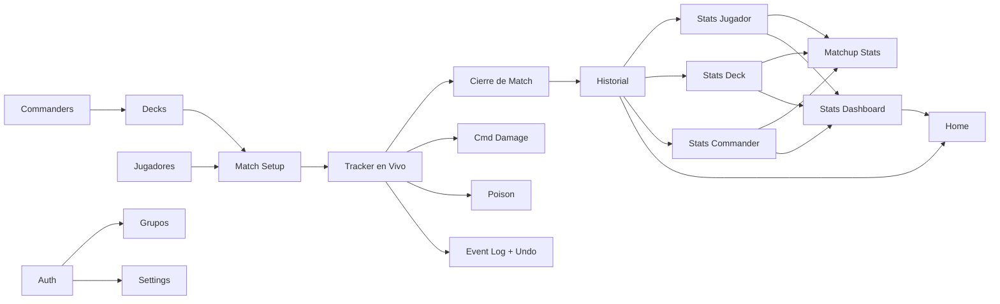

# 📋 Feature Map — MTG Commander Tracker

> Generado desde Discovery Brief §3 por `/docs`
> **Fuente:** `docs/planning/00_DISCOVERY_BRIEF.md`
> **SSOT:** Este documento define el alcance de features.
> **Versión:** 1.0 — 2026-04-09

---

## 🎯 MVP Features (v1.0) — 20 Features

> Features que **DEBEN** estar en el primer release.

| FT     | Feature                          | Descripción                                                                         | Batch | Complexity | Deps                     | Riesgo |
| ------ | -------------------------------- | ----------------------------------------------------------------------------------- | ----- | ---------- | ------------------------ | ------ |
| FT-001 | CRUD Jugadores                   | Crear, editar, soft-delete jugadores. Scoped por grupo o personal.                  | 1     | S          | —                        | Low    |
| FT-002 | CRUD Decks                       | Crear, editar, soft-delete decks (nombre + commander + descripción, sin cartas).    | 1     | M          | FT-003                   | Low    |
| FT-003 | CRUD Commanders                  | Crear, editar commanders con nombre, colores WUBRG, is_partner.                     | 1     | S          | —                        | Low    |
| FT-004 | Match Setup (2/3/4 jugadores)    | Selección de jugadores + decks + validación de no-repetición. Crea Match + Participations. | 1 | M          | FT-001, FT-002           | Med    |
| FT-005 | Match Tracker en vivo            | Pantalla dividida (2/3/4). Tracking de life, poison, commander damage. Layout rotatable por sección. | 2 | XL         | FT-004, FT-013, FT-014, FT-015 | High |
| FT-006 | Cierre de Match + Win Conditions | Seleccionar ganador manual + win condition o draw o abandon. Crea MatchResult.      | 1     | M          | FT-005                   | Low    |
| FT-007 | Historial de Matches             | Lista de matches completados/abandonados con filtros (jugador, deck, commander, fecha, resultado, win condition). Tap → detalle. | 2 | M | FT-006 | Low |
| FT-008 | Stats por Jugador                | Win rate, total matches, decks usados, commanders, racha. Accesible desde perfil de jugador. | 3 | M | FT-007 | Med |
| FT-009 | Stats por Deck                   | Win rate del deck, jugadores que lo usaron, commanders con los que se piloteó.      | 3     | M          | FT-007                   | Med    |
| FT-010 | Stats por Commander              | Win rate del commander, decks que lo usan, jugadores que lo jugaron.                | 3     | M          | FT-007                   | Med    |
| FT-011 | Matchup Stats                    | Head-to-head entre dos entidades (jugadores, decks, commanders). Filtro scope 1v1/todos. | 3 | L | FT-008, FT-009, FT-010 | High |
| FT-012 | Stats Dashboard Global           | Rankings globales y resúmenes de win rate. Vista consolidada de toda la actividad del grupo. | 3 | L | FT-008, FT-009, FT-010 | Med |
| FT-013 | Commander Damage Tracking        | Contadores de daño por `commander_id` individual. Partners: contadores separados por cada uno. | 2 | M | FT-005 | Med |
| FT-014 | Poison Counter Tracking          | Contadores de poison (infect). Floor en 0. Alerta visual al llegar a 10. Sin acción automática. | 2 | S | FT-005 | Low |
| FT-015 | Match Event Log + Undo           | Log de MatchEvents con debounce configurable. Undo ilimitado hacia atrás.           | 2     | L          | FT-005                   | High   |
| FT-016 | Auth System (multi-provider)     | Login con Email/Password, Google OAuth, Apple Sign In, Magic Link. Modo Guest sin login. | 4 | L | — | High |
| FT-017 | Friend Groups (shared DB)        | Crear grupo, invitar miembros por email/link, DB compartida scoped por grupo.       | 4     | L          | FT-016                   | High   |
| FT-018 | i18n (EN/ES)                     | Detección automática de idioma del dispositivo. Terminología MTG siempre en inglés. | 4     | M          | —                        | Low    |
| FT-019 | Settings (gestures, layout, prefs) | Configuración: swipe gestures, debounce threshold (200–2000ms), require_commander, default_life_total, idioma. | 4 | M | FT-016 | Low |
| FT-020 | Home / Navigation                | Home dashboard: match activo (banner retomar), últimas 3-5 partidas, stat highlight, CTA "Nuevo Match". Tab bar 5 tabs. | 4 | M | FT-007, FT-012 | Low |

**Total MVP:** 20 features — Batch 1 (5) + Batch 2 (5) + Batch 3 (5) + Batch 4 (5)

---

## 📋 Post-MVP Features (Fase 2)

> Features identificados para versiones futuras desde el Discovery Brief.

| FT     | Feature                  | Descripción                                             | Deps         | Target  | Complexity | Riesgo |
| ------ | ------------------------ | ------------------------------------------------------- | ------------ | ------- | ---------- | ------ |
| FT-021 | Mana Pool Tracking       | Tracking de mana disponible por jugador en vivo.        | FT-005       | v1.1    | M          | Med    |
| FT-022 | Orden de eliminación     | Registrar en qué turno fue eliminado cada jugador.      | FT-006       | v1.1    | S          | Low    |
| FT-023 | Notas por match          | Campo de notas libres asociado a un match.              | FT-006       | v1.1    | S          | Low    |
| FT-024 | Filtros avanzados Stats  | Filtros adicionales en vistas de stats (rango de fechas, color identity, etc.). | FT-012 | v1.2 | M | Med |
| FT-025 | Gráficas de win rate     | Visualización de evolución temporal del win rate.       | FT-012       | v1.2    | M          | Med    |

---

## 🚫 Non-Goals — Explícitamente fuera de scope

| NG     | Non-Goal                              | Razón                                                        | Reconsiderar en          |
| ------ | ------------------------------------- | ------------------------------------------------------------ | ------------------------ |
| NG-001 | Editor de decklists / lista de cartas | Complejidad alta, no es el core del producto                 | Fase 3                   |
| NG-002 | Integración Scryfall / Moxfield / Archidekt | Sin licencia de API en MVP; scope expansivo           | Fase 3                   |
| NG-003 | Sincronización multiusuario en tiempo real | Complejidad de infra alta, tracker es un solo dispositivo | Fase 3                   |
| NG-004 | Modo tablet dedicado                  | Scope adicional, requiere layout dedicado                    | Futuro                   |
| NG-005 | Ranking ELO / Heatmaps de commanders  | Complejidad analítica; stats básicas son suficientes en MVP  | Futuro                   |
| NG-006 | Export CSV/Excel                      | Nice-to-have; historial en app es suficiente                 | Futuro                   |
| NG-007 | Light mode                            | Solo dark mode en MVP (F34)                                  | Fase 2                   |
| NG-008 | Arte oficial Wizards of the Coast     | Sin licencia para usar arte de WotC                          | Nunca (restricción legal)|
| NG-009 | App de torneos / modo competitivo     | Audiencia diferente; el producto es casual/amigos            | Nunca (fuera de visión)  |
| NG-010 | Compartir partida en vivo             | Requiere real-time multi-device (Fase 3)                     | Fase 3                   |

---

## 🗂️ Entity Reconciliation (Brief §4 → 06_DATA_MODEL)

| #  | Entidad Brief | Ref §4 | E-XXX Asignado    | Doc Destino   | Status |
| -- | ------------- | ------ | ----------------- | ------------- | ------ |
| 1  | Commander     | E3     | E-001             | 06_DATA_MODEL | ✅     |
| 2  | Deck          | E4     | E-002             | 06_DATA_MODEL | ✅     |
| 3  | Group         | E9     | E-003             | 06_DATA_MODEL | ✅     |
| 4  | GroupMembership | E10  | E-004             | 06_DATA_MODEL | ✅     |
| 5  | Match         | E5     | E-005             | 06_DATA_MODEL | ✅     |
| 6  | MatchEvent    | E8     | E-006             | 06_DATA_MODEL | ✅     |
| 7  | MatchResult   | E7     | E-007             | 06_DATA_MODEL | ✅     |
| 8  | Participation | E6     | E-008             | 06_DATA_MODEL | ✅     |
| 9  | Player        | E2     | E-009             | 06_DATA_MODEL | ✅     |
| 10 | User          | E1     | E-010             | 06_DATA_MODEL | ✅     |
| 11 | UserSettings  | E11    | E-011             | 06_DATA_MODEL | ✅     |

---

## 🖥️ Screen Reconciliation (Brief §7.2 → 15_DESIGN)

| #   | Pantalla Brief         | ID  | Feature(s)              | UI_Stitch       | Status |
| --- | ---------------------- | --- | ----------------------- | --------------- | ------ |
| 1   | Home                   | P01 | FT-020                  | ✅ home_dashboard | ✅   |
| 2   | Jugadores              | P02 | FT-001, FT-008          | ✅ players_list  | ✅    |
| 3   | Decks                  | P03 | FT-002, FT-009          | ✅ decks_library | ✅    |
| 4   | Historial              | P04 | FT-007                  | ✅ match_history | ✅    |
| 5   | Stats Dashboard        | P05 | FT-012                  | ✅ global_stats  | ✅    |
| 6   | Setup Match            | P06 | FT-004                  | ✅ match_setup   | ✅    |
| 7   | Match Tracker          | P07 | FT-005, FT-013, FT-014, FT-015 | ✅ match_tracker_4p | ✅ |
| 8   | Cierre de Match        | P08 | FT-006                  | ❌ Pendiente     | ⚠️    |
| 9   | Resultados             | P09 | FT-006                  | ✅ match_results | ✅    |
| 10  | Detalle Match          | P10 | FT-007, FT-015          | ✅ match_detail  | ✅    |
| 11  | Perfil Jugador         | P11 | FT-008                  | ✅ player_profile | ✅   |
| 12  | Detalle Deck           | P12 | FT-009                  | ❌ Pendiente     | ⚠️    |
| 13  | Detalle Commander      | P13 | FT-010                  | ❌ Pendiente     | ⚠️    |
| 14  | Matchup Stats          | P14 | FT-011                  | ❌ Pendiente     | ⚠️    |
| 15  | CRUD Commanders        | P15 | FT-003                  | ✅ commanders_archive | ✅ |
| 16  | Auth / Login           | P16 | FT-016                  | ❌ Pendiente     | ⚠️    |
| 17  | Grupos                 | P17 | FT-017                  | ❌ Pendiente     | ⚠️    |
| 18  | Settings               | P18 | FT-019                  | ✅ settings      | ✅    |
| 19  | Guest Tracker          | P19 | FT-016 / F45            | ❌ Pendiente     | ⚠️    |

> **Nota UI_Stitch:** 12/19 pantallas tienen diseño en `docs/planning/UI_Stitch/`. Las 7 restantes deben diseñarse antes de `/backlog`. Los screens existentes se adaptan directamente a React Native.

---

## 🔗 Feature × Entity × Screen Cross-Map

| FT     | Feature                    | Entidades Principales     | Pantallas      |
| ------ | -------------------------- | ------------------------- | -------------- |
| FT-001 | CRUD Jugadores             | E-009 (Player)            | P02, P11       |
| FT-002 | CRUD Decks                 | E-002 (Deck), E-001       | P03, P12       |
| FT-003 | CRUD Commanders            | E-001 (Commander)         | P15, P13       |
| FT-004 | Match Setup                | E-005 (Match), E-008, E-009, E-002 | P06  |
| FT-005 | Match Tracker              | E-008 (Participation), E-006 | P07         |
| FT-006 | Cierre de Match            | E-007 (MatchResult), E-005 | P08, P09      |
| FT-007 | Historial                  | E-005 (Match), E-007, E-008 | P04, P10     |
| FT-008 | Stats Jugador              | E-009, E-005, E-007       | P11            |
| FT-009 | Stats Deck                 | E-002, E-005, E-007       | P12            |
| FT-010 | Stats Commander            | E-001, E-005, E-007       | P13            |
| FT-011 | Matchup Stats              | E-009, E-002, E-001       | P14            |
| FT-012 | Stats Dashboard            | Todos los anteriores      | P05            |
| FT-013 | Commander Damage           | E-008 (Participation.commander_damage), E-006 | P07 |
| FT-014 | Poison Counters            | E-008 (Participation.poison_counters), E-006 | P07 |
| FT-015 | Event Log + Undo           | E-006 (MatchEvent)        | P07, P10       |
| FT-016 | Auth                       | E-010 (User)              | P16, P19       |
| FT-017 | Friend Groups              | E-003 (Group), E-004      | P17            |
| FT-018 | i18n                       | —                         | Todas          |
| FT-019 | Settings                   | E-011 (UserSettings)      | P18            |
| FT-020 | Home / Navigation          | E-005, E-009              | P01            |

---

## 📊 Resumen

| Métrica                | Valor              |
| ---------------------- | ------------------ |
| Features MVP           | 20 (FT-001→FT-020) |
| Features Post-MVP      | 5  (FT-021→FT-025) |
| Non-Goals declarados   | 10 (NG-001→NG-010) |
| Entidades              | 11 (E-001→E-011)   |
| Pantallas              | 19 (P01→P19)       |
| Pantallas en UI_Stitch | 12/19 ✅           |
| Pantallas pendientes   | 7/19 ⚠️            |
| Cobertura de §3        | 100% (20/20 MVP features) |

---

## Dependencias Visuales

---

## Reglas de Trazabilidad

1. Toda User Story (US-XXX) debe referenciar un FT-XXX.
2. Todo Screen (P-XX) mapea a al menos un FT-XXX.
3. Todo Issue del backlog referencia FT-XXX.
4. IDs FT-XXX no se reutilizan aunque se elimine un feature.

---

## Open Questions

| #     | Pregunta                                                                            | Impacto     | Owner   |
| ----- | ----------------------------------------------------------------------------------- | ----------- | ------- |
| OQ-01 | ¿FT-020 (Home) debe mostrar match activo de cualquier grupo o solo del grupo seleccionado actualmente? | **Alto** | Cliente |
| OQ-02 | ¿FT-017 (Grupos) requiere pantalla de selección de grupo activo antes de entrar al app? | **Alto** | Cliente |
| OQ-03 | ¿Los screens pendientes en UI_Stitch (P08, P12, P13, P14, P16, P17, P19) se diseñan antes o durante /backlog? | Med | Cliente |

---

## Assumptions

| #    | Supuesto                                                                            | Si es incorrecto                        |
| ---- | ----------------------------------------------------------------------------------- | --------------------------------------- |
| A-01 | Los 20 features del Brief representan el scope exacto de MVP sin adiciones.         | Regenerar si se agregan features.       |
| A-02 | FT-013 y FT-014 son separables de FT-005 a nivel de implementación (Batch 2 independiente). | Ajustar batches en backlog.       |
| A-03 | Las IDs de pantalla (P01–P19) del Brief se mantienen en 15_DESIGN y backlog.        | Actualizar cross-references si cambian. |
| A-04 | UI_Stitch screens existentes se adaptan directamente a React Native sin rediseño.   | Requiere sesión de diseño adicional.    |

---

_Generado por TimeKast Factory — /docs_
