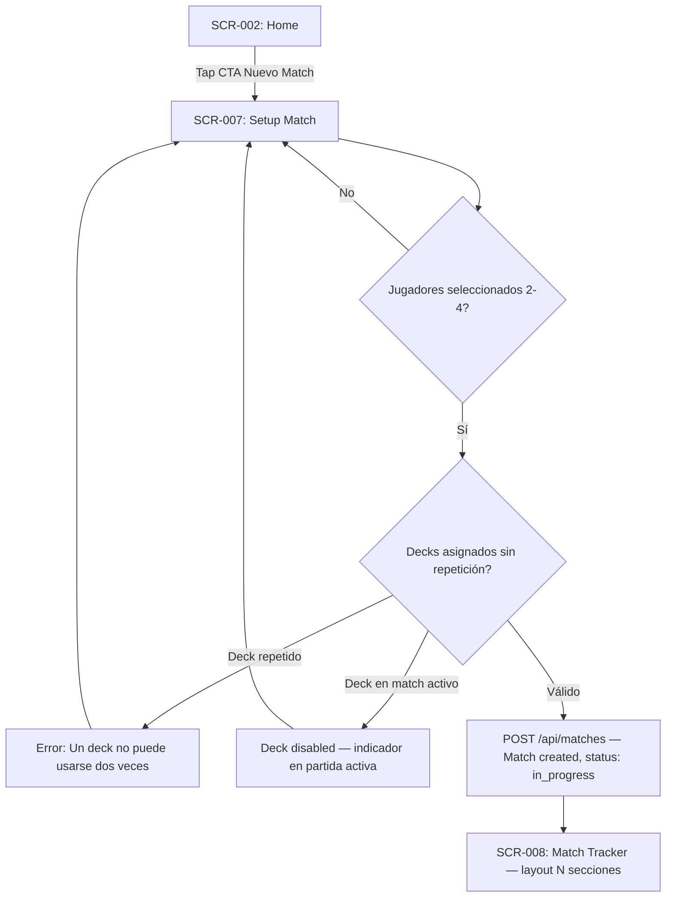
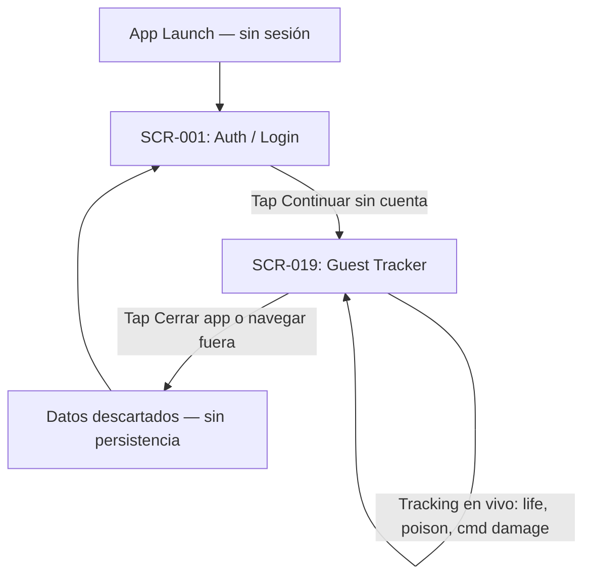
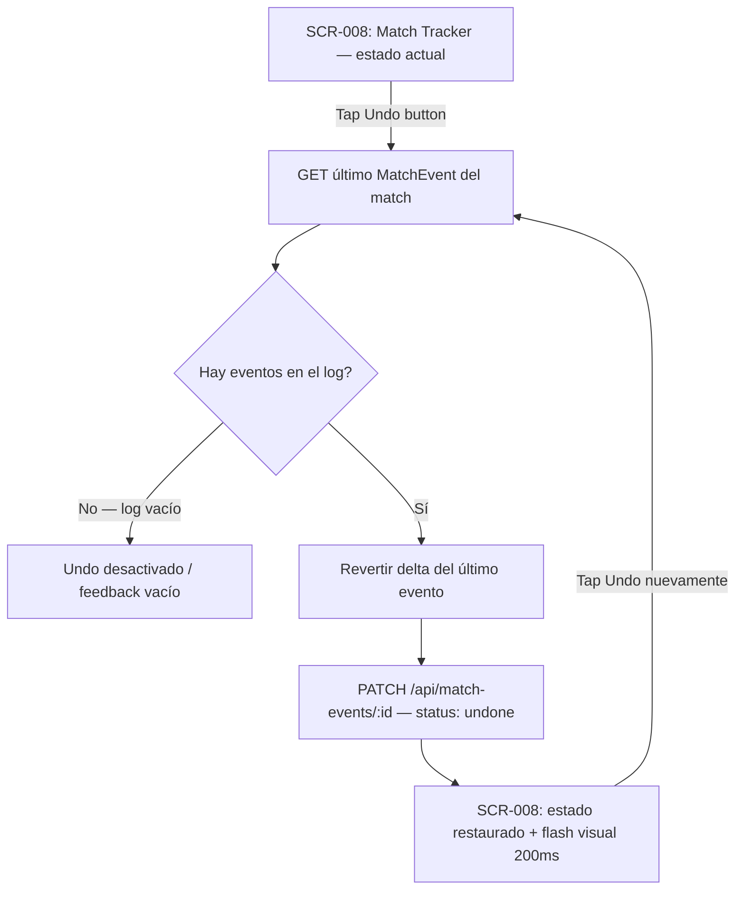
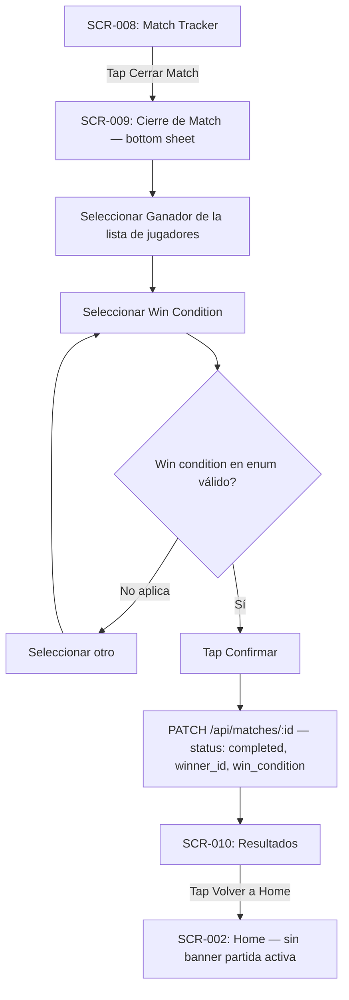
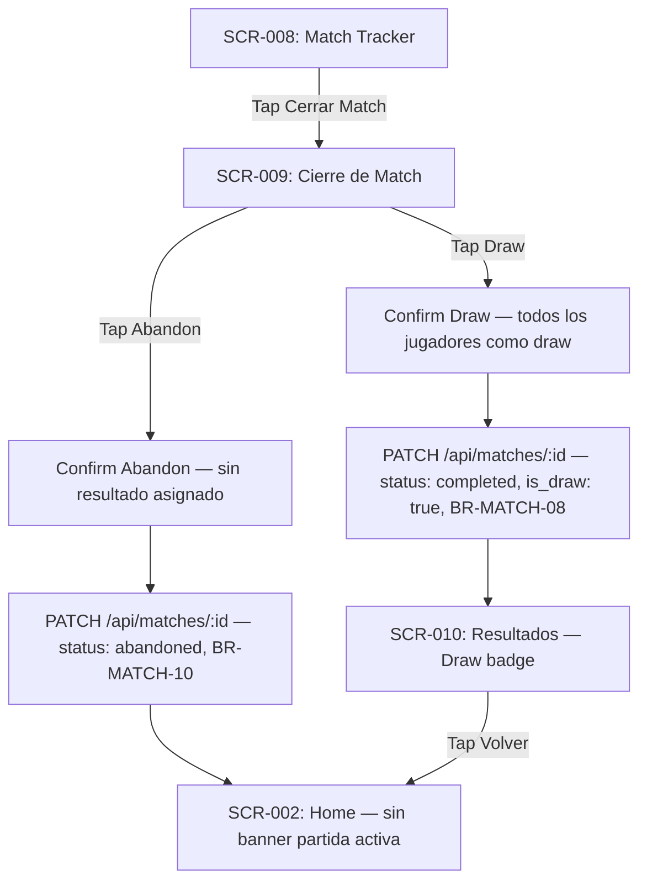
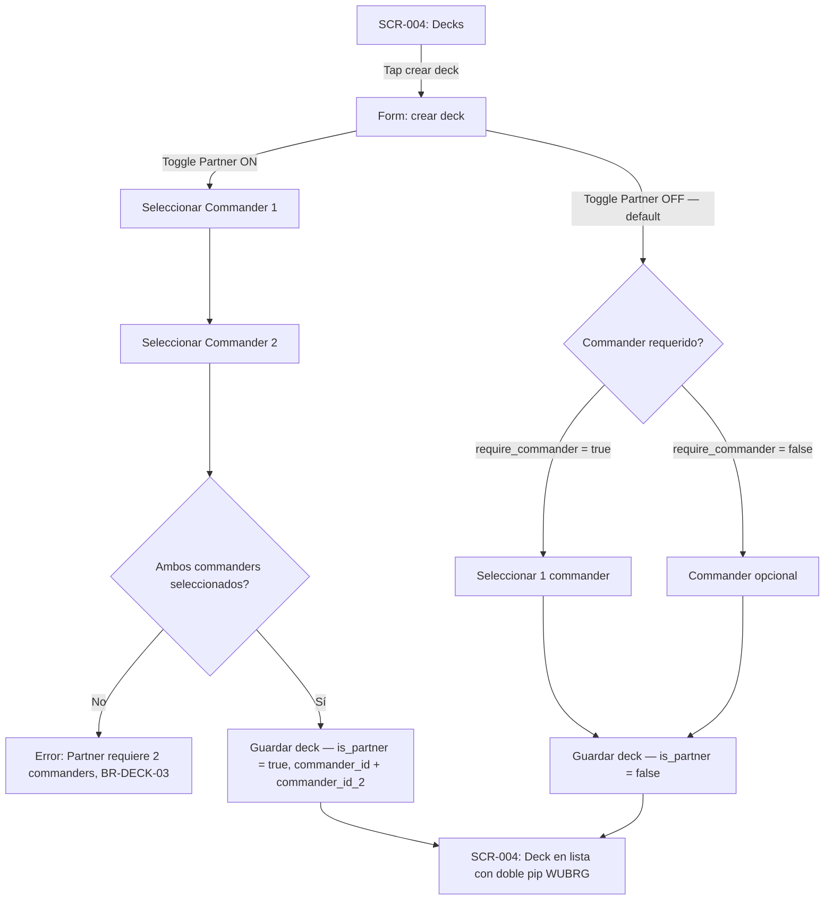
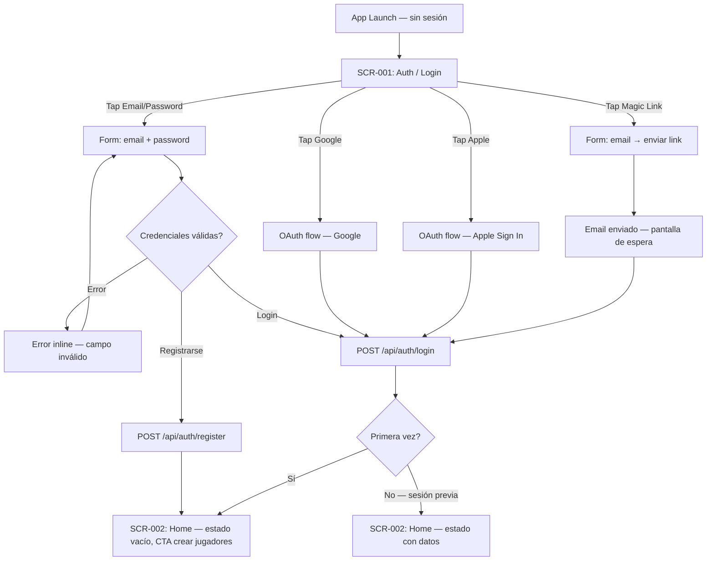
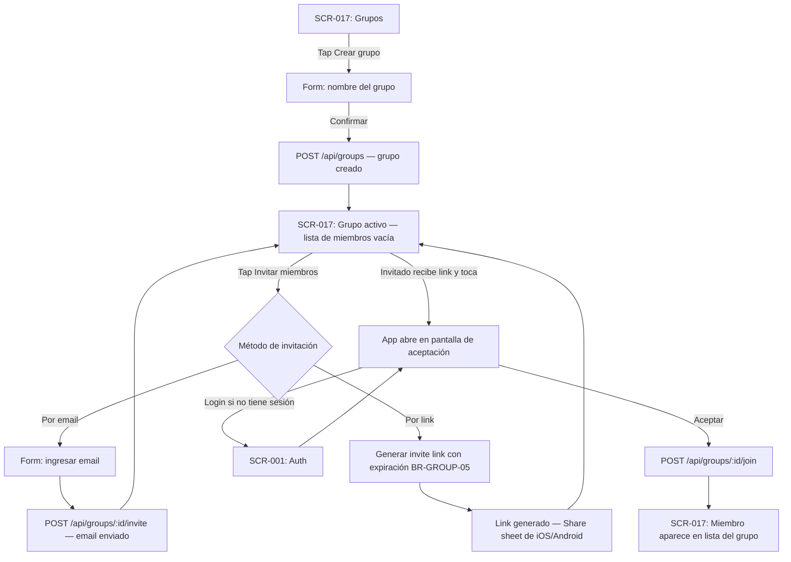
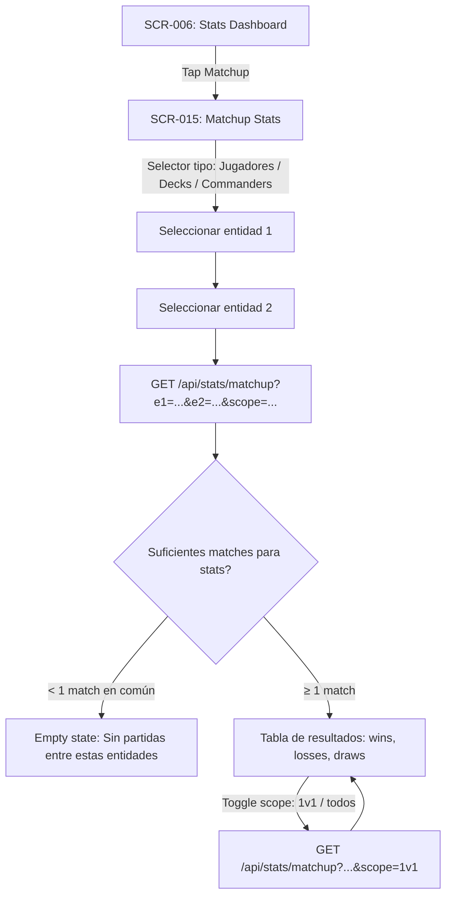
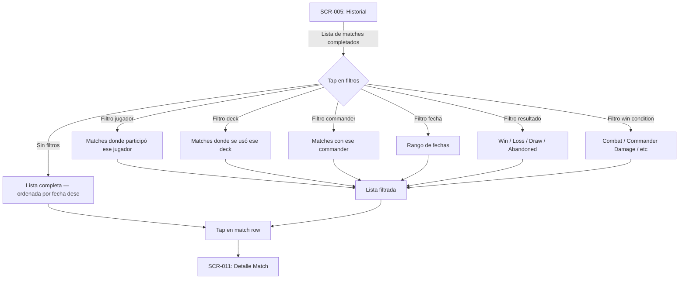

# Design Specification — MTG Commander Tracker

> Generado desde Discovery Brief y Docs por `/design`
> **Fuente:** docs/planning/00_DISCOVERY_BRIEF.md, 02–14
> **SSOT:** Este doc → código UI
> **Versión:** 1.0 — 2026-04-10
> **Status:** ✅ Completo — Pasadas 1–3 + Validación v1.0

---

## §0 Visual Direction — "The Mystic Archive"

> **Agentes:** @visual-design-director, @layout-composer
> **Design System:** The Mystic Archive (`docs/planning/UI_Stitch/aether_archway/DESIGN.md`)
> **North Star:** "The Relic Narrative" — digital grimoire, not a spreadsheet

### §0.0 Product Posture

**Premium Immersive Gaming** — una experiencia editorial de alto contraste que se siente como un artefacto vivo. Combina la legibilidad agresiva de MTG Arena con la profundidad de interfaces de lujo. Asimetría intencional, tipografía display masiva, profundidad tonal en lugar de líneas.

> **Fuente oficial:** `docs/planning/UI_Stitch/aether_archway/DESIGN.md`

### §0.1 SK Style Migration Assessment

> **Status:** Proyecto greenfield — no existe SK previo. No hay migration.
> **Design system definido en UI_Stitch/aether_archway.** Diseño desde cero.

| Aspecto | SK Actual | Proyecto | Acción |
|---------|-----------|----------|--------|
| Paradigma visual | N/A (greenfield) | The Mystic Archive | 🆕 Definir desde cero |
| Tema | N/A | Dark only MVP (V1, NG-007) | 🆕 Solo dark |
| Shadow tokens | N/A | Ambient Glow (amber 10% opacity) | 🆕 Custom |
| Borders | N/A | "No-Line Rule" — background shifts + shadow edges | 🆕 Custom |
| Layout patterns | N/A | Bottom Tab Bar + Modals + Intentional Asymmetry | 🆕 Custom |

**Creative Freedom Zones (del design system):**
- "No-Line Rule": estructura por cambios de background, no por líneas (impacto en todos los list components)
- "Glass & Gradient Rule": glassmorphism solo para elementos flotantes de gameplay (life counters, overlays del tracker)
- Asimetría intencional: headlines left-aligned, metadata right-aligned en Editorial Grid
- Tipografía overlap sobre containers — fuera de los patrones estándar de RN

**Migration Estimate:** 0 issues (greenfield).

---

### §0.2 Skin + Tone

| Atributo | Decisión | Razón |
|----------|----------|-------|
| **Sistema** | The Mystic Archive | Design system propio del proyecto (aether_archway) |
| **Visual language** | High-End Editorial + MTG Arena | Relic Narrative — artefacto vivo, no SaaS template |
| **Estructura** | Tonal Depth via background shifts | "No-Line Rule" — sin 1px borders para secciones |
| **Gameplay** | Glassmorphism en elementos flotantes | "Glass & Gradient Rule" — life counters, cmd damage overlays |
| **Accents** | Amber/Gold Legendary — raro y deliberado | Solo 1 acción `primary` por pantalla (Regla de Rareza) |
| **Modo** | Dark only MVP (V1, NG-007) | `surface` base = `#1c1102` — no pure black |

---

### §0.3 Paleta de Colores (Design Tokens)

> **Fuente:** `aether_archway/DESIGN.md §2` — The WUBRG & Amber Palette

#### Surface System (Layering Principle)

| Token | Valor hex | Material Design equivalent | Uso | Nivel |
|-------|-----------|---------------------------|-----|-------|
| `surface` | `#1c1102` | surface | Fondo principal — textured dark navy-brown | Base |
| `surface-container-low` | `#221a08` | surfaceContainerLow | Player zones, secciones de tracker | Level 1 |
| `surface-container` | `#2a2010` | surfaceContainer | Cards interactivas (70% opacity en glass mode) | Level 2 |
| `surface-container-highest` | `#342814` | surfaceContainerHighest | High-contrast focus, list items, botones secondary | Level 2+ |
| `surface-variant` | `#3a3020` | surfaceVariant | Chips (mana symbols, tags) | Variant |
| `on-surface` | `#ede0d4` | onSurface | Texto principal | — |
| `on-surface-variant` | `#a08c7c` | onSurfaceVariant | Labels, metadata, secondary text | — |
| `outline-variant` | `#52443c` | outlineVariant | "Ghost Border" a11y fallback (15% opacity) | — |

> **Don't:** No usar pure black `#000000`. Siempre `surface` `#1c1102` para el color más oscuro.

#### Primary (Amber/Gold — Legendary)

| Token | Valor hex | Uso |
|-------|-----------|-----|
| `primary` | `#eebf73` | CTA primario — botones primary, life total glow, highlights activos |
| `primary-alt` | `#c99e55` | Gradiente secundario en botones primary (135° de primary a primary_container) |
| `primary-container` | `#7a5a20` | Pressed/hover state de primary, fondo de badge gold |
| `on-primary` | `#1c0f00` | Texto sobre botones primary (dark brown) |
| `on-primary-container` | `#ffdea8` | Texto en primary-container |

> **Regla de Rareza:** Solo 1 acción `primary` por pantalla. Amber debe sentirse legendario.

#### Feedback

| Token | Valor hex | Uso |
|-------|-----------|-----|
| `color-feedback-danger` | `#cf6679` | Destructive, alertas críticas |
| `color-feedback-warning` | `#e0a030` | Alertas threshold (21 cmd damage, 10 poison) |
| `color-feedback-success` | `#5a9e5a` | Confirmaciones |
| `color-feedback-info` | `#5a8abf` | Links, info |

#### WUBRG (identidad de commanders y decks)

| Token | Valor hex | Color MTG | Uso |
|-------|-----------|-----------|-----|
| `wubrg-w` | `#f5f0d0` | White | Pips, color identity chips |
| `wubrg-u` | `#3a7bd5` | Blue | Pips, color identity chips |
| `wubrg-b` | `#6b6b7e` | Black | Pips (con ghost border para leer sobre surface) |
| `wubrg-r` | `#d4380d` | Red | Pips, color identity chips |
| `wubrg-g` | `#2d7d2d` | Green | Pips, color identity chips |
| `wubrg-c` | `#9ca3af` | Colorless | Pips — 20% opacity cuando value=0 (Counter System) |
| `wubrg-gold` | `#eebf73` | Multicolor | Decks con 3+ colores — reutiliza `primary` |

> **WCAG Contrast Ratios (sobre `surface` #1c1102):**
> - `on-surface` #ede0d4 → ratio ~14.2:1 ✅ AAA
> - `on-surface-variant` #a08c7c → ratio ~4.6:1 ✅ AA
> - `primary` #eebf73 → ratio ~8.4:1 ✅ AAA
> - `color-feedback-danger` #cf6679 → ratio ~4.5:1 ✅ AA
> - `wubrg-w` #f5f0d0 → ratio ~13.8:1 ✅ AAA
> - `wubrg-u` #3a7bd5 → ratio ~4.5:1 ✅ AA

#### Ambient Glow (Shadows)

> Sin Material Design shadows. Solo Ambient Glow amber.

| Token | Valor | Uso |
|-------|-------|-----|
| `glow-ambient` | `primary` 10% opacity, 0px Y, 20px blur | Elementos flotantes, modales — "magical radiance" |
| `glow-alert` | `color-feedback-warning` 30% opacity, 0px, 12px | Alerta 21 cmd damage / 10 poison (pulsing) |
| `ghost-border` | `outline-variant` 15% opacity | A11y fallback para buttons en low-light states |

---

### §0.4 Typography

> **Fuente:** `aether_archway/DESIGN.md §3` — Display-First approach
> **React Native:** Fuentes via `expo-font` + `@expo-google-fonts`

| Token | Fuente | Weight | Uso |
|-------|--------|--------|-----|
| `font-display` | Space Grotesk | 700 Bold | Life totals (display-lg), phase transitions ("UPKEEP"), títulos masivos |
| `font-headline` | Space Grotesk | 600 SemiBold | "Card Name" — nombres de commanders, deck names en cards destacadas |
| `font-body` | Manrope | 400 Regular | "Rules Text" — body, listas, descripciones |
| `font-body-medium` | Manrope | 500 Medium | Labels, botones, metadata importante |
| `font-mono` | Manrope | 400 Regular | Event log, timestamps (Manrope tiene buen mono feel sin ser técnico) |

**Escala de tamaños (sp):**

| Token | sp | Fuente | Uso |
|-------|-----|--------|-----|
| `label-sm` | 11sp | Manrope 500 | Chips/mana symbols CAPS, caption |
| `body-sm` | 13sp | Manrope 400 | Metadata, secondary info |
| `body-md` | 15sp | Manrope 400 | Body, listas |
| `body-lg` | 17sp | Manrope 500 | Sub-header, nombre en lista |
| `headline-sm` | 20sp | Space Grotesk 600 | Sección header |
| `headline-md` | 24sp | Space Grotesk 700 | Título pantalla, phase labels |
| `headline-lg` | 32sp | Space Grotesk 700 | Título display (Home header) |
| `display-sm` | 48sp | Space Grotesk 700 | Life total en 4-player layout |
| `display-md` | 64sp | Space Grotesk 700 | Life total en 3-player layout |
| `display-lg` | 80sp | Space Grotesk 700 | Life total en 2-player layout |

**Reglas de composición (Editorial Grid):**
- NUNCA center-align todo — left-aligned headlines + right-aligned metadata
- Permitir que tipografía overlap el edge de containers levemente (feel "bespoke")
- Si un headline es grande, hacerlo MASIVO — nunca tamaños intermedios para display

**Density rule:** Body mínimo 15sp en tracker. Life total mínimo 48sp (iPhone SE — BR-TRACK-07 + Risk R3).

---

### §0.5 Componentes Clave del Design System

> **Fuente:** `aether_archway/DESIGN.md §5`

#### Botones — "The Spell System"

| Tipo | Background | Text | Border | Uso |
|------|-----------|------|--------|-----|
| **Primary** | Gradient `primary` → `primary-alt` (135°) + metallic emboss | `on-primary` (dark brown) | None | 1 por pantalla — acción crítica |
| **Secondary** | `surface-container-highest` | `primary` | None | Acciones "Cast" no finales |
| **Tertiary** | Transparent | `on-surface` | None | "Cancel", "Settings", acciones destructivas suaves |

- Roundedness: `md` — border-radius 6dp
- Pressed: escala a 98% + `primary-container` background glow

#### Cards / Listas — "The Library Layout"

- Fondo de lista: `surface-container-low`
- Items individuales: `surface-container-highest`
- **Sin dividers** entre items — separación por negative space
- Tap: scale down 98% + aumento de Ambient Glow

#### Gameplay Inputs — "The Counter System"

- Life totals: `display-*` (Space Grotesk 700) — outer glow `primary` cuando el valor cambia
- WUBRG counters: contenedores circulares con hex WUBRG exacto — opacity 20% cuando value=0
- Glassmorphism en life counter panels: `surface-container` 70% opacity + 20dp backdrop-blur

#### Chips — Mana Symbols & Tags

- Pill shape — border-radius full
- Background: `surface-variant`
- Text: `on-surface-variant`, `label-sm` CAPS

---

### §0.6 Motion Profile

**Tono:** Crisp + Premium (MTG Arena feel)

| Tipo | Duración | Easing | Trigger |
|------|----------|--------|---------|
| Life total change (glow pulse) | 80ms on + 200ms fade | ease-out | Tap +/- |
| Life total bounce | 180ms total | spring (damping 12) | After delta |
| Card tap (scale 98%) | 80ms | ease-out | Press |
| Tab switch | 150ms | ease-in-out | Tab tap |
| Modal open | 300ms | ease-out | CTA |
| Modal close | 220ms | ease-in | Dismiss |
| Sheet open (Cierre) | 280ms | spring (damping 15) | Tap "Cerrar" |
| Page push | 250ms | ease-out | Row tap |
| Alert glow pulse (21 cmd / 10 poison) | 600ms loop | ease-in-out | Threshold |
| Section rotation (tracker) | 350ms | spring (damping 18) | Gesture |
| Undo flash | 200ms | ease-out | Undo tap |
| Empty state fade-in | 300ms | ease-out | Mount |

**Interaction feedback:**
- Pressed: scale 0.98 + `primary-container` glow (80ms)
- Selected tab: `primary` underline indicator, 150ms
- Focused (a11y): ghost-border 2dp ring
- Disabled: opacity 0.38

**Reduced motion** (Expo AccessibilityInfo):
- Transiciones de página/modal → instantáneas
- Mantener pressed opacity
- Alert pulse → static amber badge

---

### §0.7 Shell + Navegación General

**Shell type:** Bottom Tab Bar (`@react-navigation/bottom-tabs`)

```
┌─────────────────────────────────────────────────────────┐
│  [Status Bar — hidden en tracker full-screen]            │
├─────────────────────────────────────────────────────────┤
│                                                          │
│                  CONTENT AREA                            │
│         surface (#1c1102) base                           │
│         Tonal layering: low → container → highest        │
│                                                          │
├─────────────────────────────────────────────────────────┤
│  🏠 Home  │  👤 Jugadores  │  🃏 Decks  │  📜 Hist  │  📊 Stats │
│  (Tab bar — surface, siempre visible, oculto en modales) │
└─────────────────────────────────────────────────────────┘
```

- Tab bar hidden en: SCR-007, SCR-008, SCR-009, SCR-019
- Safe area insets en todos los devices (notch, home indicator)
- Settings (SCR-018): icono gear en header SCR-002 — fuera del tab bar

---

### §0.8 Anti-Patterns (del Design System)

1. ❌ Pure black `#000000` — siempre `surface` `#1c1102`
2. ❌ 1px solid borders para seccionar — usar background shifts o negative space
3. ❌ Material Design shadows — solo Ambient Glow amber
4. ❌ Center-align todo — editorial grid: left headline + right metadata
5. ❌ Más de 1 acción `primary` (amber) por pantalla — amber es legendario, debe ser raro
6. ❌ Glassmorphism fuera de gameplay elements (life counters, overlays del tracker)
7. ❌ Life total en tamaño pequeño — mínimo `display-sm` (48sp) en tracker
8. ❌ Dark mode backgrounds claros — toda la escala de surfaces debe estar en el rango `#1c1102`–`#342814`
9. ❌ Standard "SaaS" card grids — favorecer jerarquía editorial con asimetría intencional

---

## §1 Mapa de Pantallas

> **Total:** 19 pantallas (SCR-001 → SCR-019)
> **Acceso:** P-001=Guest, P-002=User, P-003=Group Member, P-004=Group Owner
> **Routes:** Expo Router file-based (React Native)

| ID | Pantalla | Route | Tipo | Acceso | Features | Stories | UI_Stitch |
|----|----------|-------|------|--------|----------|---------|-----------|
| SCR-001 | Auth / Login | `/auth` | Screen (gate) | Público | FT-016 | US-035, US-036, US-037 | ✅ `auth_login` |
| SCR-002 | Home | `/(tabs)/` | Tab | P-002, P-003, P-004 | FT-020 | US-044, US-045 | ✅ `home_dashboard` |
| SCR-003 | Jugadores | `/(tabs)/players` | Tab | P-002, P-003, P-004 | FT-001, FT-008 | US-001–003, US-022–023 | ✅ `players_list` |
| SCR-004 | Decks | `/(tabs)/decks` | Tab | P-002, P-003, P-004 | FT-002, FT-009 | US-004–007, US-024 | ✅ `decks_library` |
| SCR-005 | Historial | `/(tabs)/history` | Tab | P-002, P-003, P-004 | FT-007 | US-019–021 | ✅ `match_history` |
| SCR-006 | Stats Dashboard | `/(tabs)/stats` | Tab | P-002, P-003, P-004 | FT-012 | US-028–029 | ✅ `global_stats` |
| SCR-007 | Setup Match | `/match/setup` | Modal (full) | P-002, P-003, P-004 | FT-004 | US-010–012 | ✅ `match_setup` |
| SCR-008 | Match Tracker | `/match/[id]/tracker` | Modal (full) | P-002, P-003, P-004 | FT-005, FT-013, FT-014, FT-015 | US-013–015, US-030–034 | ✅ `match_tracker_4p` |
| SCR-009 | Cierre de Match | `/match/[id]/close` | Sheet (desde SCR-008) | P-002, P-003, P-004 | FT-006 | US-016–018 | ✅ `cierre_de_match` |
| SCR-010 | Resultados | `/match/[id]/results` | Screen (push) | P-002, P-003, P-004 | FT-006 | US-016–017 | ✅ `match_results` |
| SCR-011 | Detalle Match | `/match/[id]` | Screen (push) | P-002, P-003, P-004 | FT-007, FT-015 | US-021, US-034 | ✅ `match_detail` |
| SCR-012 | Perfil Jugador | `/players/[id]` | Screen (push) | P-002, P-003, P-004 | FT-008 | US-022–023 | ✅ `player_profile` |
| SCR-013 | Detalle Deck | `/decks/[id]` | Screen (push) | P-002, P-003, P-004 | FT-009 | US-024 | ✅ `detalle_del_deck` |
| SCR-014 | Detalle Commander | `/commanders/[id]` | Screen (push) | P-002, P-003, P-004 | FT-010 | US-025 | ✅ `detail_commander` |
| SCR-015 | Matchup Stats | `/stats/matchup` | Screen (push) | P-002, P-003, P-004 | FT-011 | US-026–027 | ✅ `matchup_stats` |
| SCR-016 | CRUD Commanders | `/commanders` | Screen (push) | P-002, P-003, P-004 | FT-003 | US-008–009 | ✅ `commanders_archive` + `crud_commanders` |
| SCR-017 | Grupos | `/groups` | Screen (push) | P-002, P-003, P-004 | FT-017 | US-038–040 | ✅ `friend_groups` |
| SCR-018 | Settings | `/settings` | Screen (push) | P-002, P-003, P-004 | FT-018, FT-019 | US-041–043 | ✅ `settings` |
| SCR-019 | Guest Tracker | `/guest` | Modal (full) | P-001 (Guest) | FT-016 (F45) | US-037 | ✅ `guest_tracker` |

---

### Detalle por Pantalla

#### SCR-001 — Auth / Login

| Campo | Valor |
|-------|-------|
| **Route** | `/auth` |
| **Propósito** | Gate de autenticación. Bienvenida + opciones de login + modo guest. |
| **Acceso** | Público (mostrado solo si no hay sesión activa) |
| **Features** | FT-016 |
| **Implementa** | US-035, US-036, US-037 |
| **Valida** | BR-AUTH-01, BR-AUTH-02, BR-AUTH-05 |
| **Data** | E-010 (User) |
| **UI_Stitch** | ✅ `auth_login` |
| **Scope Note** | Upgrade Guest→User mid-match diferido a v1.1 (OQ-02 en 03_USER_PERSONAS). En MVP, Auth gate es solo al inicio. |

#### SCR-002 — Home

| Campo | Valor |
|-------|-------|
| **Route** | `/(tabs)/` |
| **Propósito** | Dashboard principal post-login. Match activo, últimas partidas, stat highlight, CTA Nuevo Match. |
| **Acceso** | P-002, P-003, P-004 |
| **Features** | FT-020 |
| **Implementa** | US-044, US-045 |
| **Data** | E-005 (Match), E-009 (Player) |
| **UI_Stitch** | ✅ `home_dashboard` |
| **Scope Note** | Banner "Partida en curso" (CMP-015) muestra el match activo del **grupo/contexto activo seleccionado** (`GroupContext.activeGroupId`). Si `activeGroupId = null`, muestra matches personales. Decisión: ADR-004 ✅ (Opción B). |

#### SCR-003 — Jugadores

| Campo | Valor |
|-------|-------|
| **Route** | `/(tabs)/players` |
| **Propósito** | Lista de jugadores con CRUD inline. Tap → SCR-012 (perfil con stats). |
| **Acceso** | P-002 (personal), P-003/P-004 (grupo activo) |
| **Features** | FT-001, FT-008 |
| **Implementa** | US-001, US-002, US-003, US-022, US-023 |
| **Valida** | BR-ENTITY-01, BR-ENTITY-02, BR-ENTITY-03 |
| **Data** | E-009 (Player) |
| **UI_Stitch** | ✅ `players_list` |

#### SCR-004 — Decks

| Campo | Valor |
|-------|-------|
| **Route** | `/(tabs)/decks` |
| **Propósito** | Lista de decks con CRUD inline. Filtrable por commander. Tap → SCR-013. |
| **Acceso** | P-002 (personal), P-003/P-004 (grupo activo) |
| **Features** | FT-002, FT-009 |
| **Implementa** | US-004, US-005, US-006, US-007, US-024 |
| **Valida** | BR-DECK-01 a BR-DECK-08 |
| **Data** | E-002 (Deck), E-001 (Commander) |
| **UI_Stitch** | ✅ `decks_library` |

#### SCR-005 — Historial

| Campo | Valor |
|-------|-------|
| **Route** | `/(tabs)/history` |
| **Propósito** | Lista de matches completados/abandonados. Filtros completos. Tap → SCR-011. |
| **Acceso** | P-002 (personal), P-003/P-004 (grupo activo) |
| **Features** | FT-007 |
| **Implementa** | US-019, US-020, US-021 |
| **Valida** | BR-MATCH-06, BR-MATCH-07, BR-STATS-08 |
| **Data** | E-005 (Match), E-007 (MatchResult), E-008 (Participation) |
| **UI_Stitch** | ✅ `match_history` |

#### SCR-006 — Stats Dashboard

| Campo | Valor |
|-------|-------|
| **Route** | `/(tabs)/stats` |
| **Propósito** | Dashboard global: rankings de win rate por jugador/deck/commander. CTA → SCR-015 (matchup). |
| **Acceso** | P-002 (personal), P-003/P-004 (grupo activo) |
| **Features** | FT-012 |
| **Implementa** | US-028, US-029 |
| **Valida** | BR-STATS-01, BR-STATS-03, BR-STATS-07, BR-STATS-09 |
| **Data** | E-005, E-007, E-008, E-009 |
| **UI_Stitch** | ✅ `global_stats` |
| **Scope Note** | Stats on-demand sin cache en MVP (BR-STATS-09). Loading state explícito requerido. |

#### SCR-007 — Setup Match

| Campo | Valor |
|-------|-------|
| **Route** | `/match/setup` |
| **Propósito** | Modal full-screen. Wizard de 1 paso: seleccionar 2–4 jugadores + asignar deck a cada uno. |
| **Acceso** | P-002, P-003, P-004 |
| **Features** | FT-004 |
| **Implementa** | US-010, US-011, US-012 |
| **Valida** | BR-MATCH-01, BR-MATCH-02, BR-MATCH-03, BR-MATCH-04, BR-DECK-06 |
| **Data** | E-005 (Match), E-008 (Participation), E-009 (Player), E-002 (Deck) |
| **UI_Stitch** | ✅ `match_setup` |

#### SCR-008 — Match Tracker

| Campo | Valor |
|-------|-------|
| **Route** | `/match/[id]/tracker` |
| **Propósito** | Tracker full-screen. Layout dividido 2/3/4 secciones. Life, poison, commander damage. Undo, event log, cierre. |
| **Acceso** | P-002, P-003, P-004 (match con decks). P-001 → SCR-019 |
| **Features** | FT-005, FT-013, FT-014, FT-015 |
| **Implementa** | US-013, US-014, US-015, US-030, US-031, US-032, US-033, US-034 |
| **Valida** | BR-TRACK-01 a BR-TRACK-13 |
| **Data** | E-008 (Participation), E-006 (MatchEvent) |
| **UI_Stitch** | ✅ `match_tracker_4p` |
| **Scope Note** | Layout 4-player en UI_Stitch. Layouts 2p y 3p son variantes del mismo componente. Rotación individual (BR-TRACK-13) requiere componente CMP-XXX (Pass 2). |

#### SCR-009 — Cierre de Match

| Campo | Valor |
|-------|-------|
| **Route** | `/match/[id]/close` (sheet desde SCR-008) |
| **Propósito** | Bottom sheet. Seleccionar resultado: ganador + win condition, draw, o abandoned. |
| **Acceso** | P-002, P-003, P-004 |
| **Features** | FT-006 |
| **Implementa** | US-016, US-017, US-018 |
| **Valida** | BR-MATCH-05, BR-MATCH-08, BR-MATCH-09, BR-MATCH-10 |
| **Data** | E-007 (MatchResult), E-005 (Match) |
| **UI_Stitch** | ✅ `cierre_de_match` |

#### SCR-010 — Resultados

| Campo | Valor |
|-------|-------|
| **Route** | `/match/[id]/results` |
| **Propósito** | Pantalla de resumen post-match. Ganador, win condition, stats rápidas del match. |
| **Acceso** | P-002, P-003, P-004 |
| **Features** | FT-006 |
| **Implementa** | US-016, US-017 |
| **Data** | E-007 (MatchResult), E-005 (Match), E-008 (Participation) |
| **UI_Stitch** | ✅ `match_results` |

#### SCR-011 — Detalle Match

| Campo | Valor |
|-------|-------|
| **Route** | `/match/[id]` |
| **Propósito** | Info completa del match: participantes, decks, resultado, event log expandido. |
| **Acceso** | P-002, P-003, P-004 |
| **Features** | FT-007, FT-015 |
| **Implementa** | US-021, US-034 |
| **Data** | E-005 (Match), E-006 (MatchEvent), E-007 (MatchResult), E-008 (Participation) |
| **UI_Stitch** | ✅ `match_detail` |

#### SCR-012 — Perfil Jugador

| Campo | Valor |
|-------|-------|
| **Route** | `/players/[id]` |
| **Propósito** | Stats completas del jugador: win rate, total matches, decks/commanders más usados, racha. |
| **Acceso** | P-002, P-003, P-004 |
| **Features** | FT-008 |
| **Implementa** | US-022, US-023 |
| **Valida** | BR-STATS-01, BR-STATS-02, BR-STATS-09 |
| **Data** | E-009 (Player), E-005, E-007, E-008 |
| **UI_Stitch** | ✅ `player_profile` |

#### SCR-013 — Detalle Deck

| Campo | Valor |
|-------|-------|
| **Route** | `/decks/[id]` |
| **Propósito** | Stats del deck: win rate, jugadores que lo usaron, commanders con los que se piloteó. |
| **Acceso** | P-002, P-003, P-004 |
| **Features** | FT-009 |
| **Implementa** | US-024 |
| **Valida** | BR-STATS-04 |
| **Data** | E-002 (Deck), E-001 (Commander), E-005, E-007 |
| **UI_Stitch** | ✅ `detalle_del_deck` |

#### SCR-014 — Detalle Commander

| Campo | Valor |
|-------|-------|
| **Route** | `/commanders/[id]` |
| **Propósito** | Stats del commander: win rate, decks que lo usan, jugadores que lo jugaron. WUBRG pips. |
| **Acceso** | P-002, P-003, P-004 |
| **Features** | FT-010 |
| **Implementa** | US-025 |
| **Valida** | BR-STATS-05 (partners — stats independientes) |
| **Data** | E-001 (Commander), E-002, E-005, E-007, E-008 |
| **UI_Stitch** | ✅ `detail_commander` |

#### SCR-015 — Matchup Stats

| Campo | Valor |
|-------|-------|
| **Route** | `/stats/matchup` |
| **Propósito** | Head-to-head entre dos entidades (jugadores, decks, commanders). Filtro scope 1v1/todos. |
| **Acceso** | P-002, P-003, P-004 |
| **Features** | FT-011 |
| **Implementa** | US-026, US-027 |
| **Valida** | BR-STATS-06 |
| **Data** | E-009, E-002, E-001, E-005, E-007 |
| **UI_Stitch** | ✅ `matchup_stats` |

#### SCR-016 — CRUD Commanders

| Campo | Valor |
|-------|-------|
| **Route** | `/commanders` |
| **Propósito** | Lista de commanders + crear/editar. Pips WUBRG. Toggle Partner. |
| **Acceso** | P-002, P-003, P-004 |
| **Features** | FT-003 |
| **Implementa** | US-008, US-009 |
| **Valida** | BR-ENTITY-04, BR-ENTITY-05 |
| **Data** | E-001 (Commander) |
| **UI_Stitch** | ✅ `commanders_archive` |

#### SCR-017 — Grupos

| Campo | Valor |
|-------|-------|
| **Route** | `/groups` |
| **Propósito** | Crear grupo, ver miembros, generar link de invitación, gestionar membresías. |
| **Acceso** | P-002 (crear/unirse), P-003 (ver miembros), P-004 (gestionar) |
| **Features** | FT-017 |
| **Implementa** | US-038, US-039, US-040 |
| **Valida** | BR-GROUP-01 a BR-GROUP-05 |
| **Data** | E-003 (Group), E-004 (GroupMembership), E-010 (User) |
| **UI_Stitch** | ✅ `friend_groups` |
| **Scope Note** | La pantalla es exclusivamente de **gestión**: ver mis grupos, crear grupo, invitar miembros. La selección de grupo activo NO ocurre aquí — se hace via context switcher chip en el header de SCR-002 (Home). Decisión: ADR-005 ✅ (Opción A). SCR-020 descartado. |

#### SCR-018 — Settings

| Campo | Valor |
|-------|-------|
| **Route** | `/settings` |
| **Propósito** | Configuración de usuario: tracker (debounce, gestures), match setup (life inicial, commander req.), idioma, cuenta. |
| **Acceso** | P-002, P-003, P-004 |
| **Features** | FT-018, FT-019 |
| **Implementa** | US-041, US-042, US-043 |
| **Valida** | BR-TRACK-08, BR-TRACK-09, BR-TRACK-10, BR-TRACK-12, BR-DECK-02, BR-AUTH-03, BR-AUTH-04, BR-I18N-01 |
| **Data** | E-011 (UserSettings), E-010 (User) |
| **UI_Stitch** | ✅ `settings` |

#### SCR-019 — Guest Tracker

| Campo | Valor |
|-------|-------|
| **Route** | `/guest` |
| **Propósito** | Tracker básico sin login. Solo life/poison/commander damage en sesión. Sin decks registrados. Datos descartados al cerrar. |
| **Acceso** | P-001 (Guest) exclusivamente |
| **Features** | FT-016 (F45 — Guest mode) |
| **Implementa** | US-037 |
| **Valida** | BR-AUTH-01, BR-AUTH-02 |
| **Data** | Ninguna (sesión local sin persistencia) |
| **UI_Stitch** | ✅ `guest_tracker` |
| **Scope Note** | Nombres de jugadores ad-hoc (OQ-01 en 03_USER_PERSONAS) — MVP muestra "Player 1-4". Upgrade Guest→User diferido a v1.1. |

---

## §2 Navegación

### Arquitectura de Navegación (Expo Router)

```
app/
├── auth.tsx                    → SCR-001 (Auth gate)
├── guest.tsx                   → SCR-019 (Guest Tracker, modal)
├── (tabs)/
│   ├── index.tsx               → SCR-002 (Home)
│   ├── players.tsx             → SCR-003 (Jugadores)
│   ├── decks.tsx               → SCR-004 (Decks)
│   ├── history.tsx             → SCR-005 (Historial)
│   └── stats.tsx               → SCR-006 (Stats Dashboard)
├── match/
│   ├── setup.tsx               → SCR-007 (Setup Match, modal)
│   └── [id]/
│       ├── tracker.tsx         → SCR-008 (Match Tracker, modal)
│       ├── close.tsx           → SCR-009 (Cierre, sheet)
│       ├── results.tsx         → SCR-010 (Resultados)
│       └── index.tsx           → SCR-011 (Detalle Match)
├── players/[id].tsx            → SCR-012 (Perfil Jugador)
├── decks/[id].tsx              → SCR-013 (Detalle Deck)
├── commanders/
│   ├── index.tsx               → SCR-016 (CRUD Commanders)
│   └── [id].tsx                → SCR-014 (Detalle Commander)
├── stats/matchup.tsx           → SCR-015 (Matchup Stats)
├── groups.tsx                  → SCR-017 (Grupos)
└── settings.tsx                → SCR-018 (Settings)
```

### Tab Bar

| Tab | Ícono | Route | RBAC |
|-----|-------|-------|------|
| Home | home-outline | `/(tabs)/` | P-002, P-003, P-004 |
| Jugadores | person-outline | `/(tabs)/players` | P-002, P-003, P-004 |
| Decks | cards-outline | `/(tabs)/decks` | P-002, P-003, P-004 |
| Historial | time-outline | `/(tabs)/history` | P-002, P-003, P-004 |
| Stats | bar-chart-outline | `/(tabs)/stats` | P-002, P-003, P-004 |

Tab bar oculto en: SCR-007, SCR-008, SCR-009, SCR-019.

### Puntos de Entrada Secundarios

| Acceso | Desde | Hacia | Tipo |
|--------|-------|-------|------|
| Settings | SCR-002 header (gear icon) | SCR-018 | Push |
| Nuevo Match (CTA) | SCR-002 | SCR-007 | Modal present |
| Continuar sin cuenta | SCR-001 | SCR-019 | Modal present |
| Banner "Partida en curso" | SCR-002 | SCR-008 | Modal present |
| Tap jugador | SCR-003 | SCR-012 | Push |
| Tap deck | SCR-004 | SCR-013 | Push |
| Tap commander | SCR-016 | SCR-014 | Push |
| Tap match | SCR-005 | SCR-011 | Push |
| Ver matchup | SCR-006 | SCR-015 | Push |
| Grupos | SCR-018 / SCR-002 | SCR-017 | Push |

### RBAC Nav Rules

- **P-001 (Guest):** Solo SCR-001 → SCR-019. Sin tab bar, sin push screens.
- **P-002 (User):** Acceso completo a tabs + push screens. SCR-017 muestra solo grupos propios.
- **P-003 (Group Member):** Igual que P-002. SCR-017 muestra grupo al que pertenece.
- **P-004 (Group Owner):** Igual que P-003 + controls de administración en SCR-017.

---

## §3 Flujos Principales

### FLW-001: Nuevo Match (Usuario Logueado)

**Descripción:** Flujo principal — desde Home hasta tracker activo.
**Personas:** P-002, P-003, P-004
**Stories:** US-010 → US-013
**Features:** FT-004, FT-005



**Estados:**
- Happy path: 4 jugadores, 4 decks distintos → tracker inmediato
- Error BR-MATCH-02: deck repetido → botón "Iniciar" desactivado con mensaje inline
- Error BR-MATCH-04: deck en match activo → deck grayed out con badge "En partida"
- Edge case: 2 jugadores válido (BR-MATCH-01)

> **Flujo paralelo — Retomar Match Activo:** Si ya existe un match `in_progress`, `CMP-015 (ActiveMatchBanner)` en SCR-002 permite retomar sin pasar por SCR-007. Al tap: `GET /matches/:id` → restaurar estado desde MatchEvents → SCR-008. Este flujo no crea un nuevo match, solo navega al tracker existente. Ver §5.0 (Cache Model — retomar) para detalles.

---

### FLW-002: Tracking Guest (Sin Cuenta)

**Descripción:** Usuario sin cuenta inicia tracker básico sin persistencia.
**Personas:** P-001 (Guest)
**Stories:** US-037
**Features:** FT-016 (F45)



**Estados:**
- Happy path: tracker básico con 2-4 secciones numeradas (Player 1-4)
- Sin acceso a decks, historial, stats
- Sin persistencia al cerrar (BR-AUTH-01)

---

### FLW-003: Undo en Tracker

**Descripción:** Revertir el último cambio de estado en el tracker.
**Personas:** P-002, P-003, P-004
**Stories:** US-033
**Features:** FT-015



**Estados:**
- Happy path: undo ilimitado hacia atrás (BR-TRACK-11)
- Edge case: log vacío → botón Undo desactivado visualmente
- Edge case: match recién iniciado sin eventos → sin undo disponible

---

### FLW-004: Cerrar Match — Ganador + Win Condition

**Descripción:** Registrar resultado de un match con ganador explícito.
**Personas:** P-002, P-003, P-004
**Stories:** US-016
**Features:** FT-006



**Estados:**
- Happy path: ganador + win condition → resultados
- BR-MATCH-05: resultado SIEMPRE manual, app no asigna automáticamente
- Win conditions enum (BR-MATCH-09): `combat_damage`, `commander_damage`, `infect`, `combo`, `mill`, `scoop`, `concede`, `other` (8 valores — ver BR-MATCH-09)

---

### FLW-005: Cerrar Match — Draw o Abandoned

**Descripción:** Registrar match sin ganador (empate o abandono).
**Personas:** P-002, P-003, P-004
**Stories:** US-017, US-018
**Features:** FT-006



**Estados:**
- Draw: MatchResult con is_draw=true, no winner_id (BR-MATCH-08)
- Abandoned: Match status=abandoned, participations sin resultado (BR-MATCH-10)
- BR-MATCH-06: abandoned excluido de stats

---

### FLW-006: Crear Deck con Partner Commanders

**Descripción:** Registrar un deck con dos commanders partner.
**Personas:** P-002, P-003, P-004
**Stories:** US-005
**Features:** FT-002, FT-003



**Estados:**
- Partner OFF: 1 commander (o ninguno si setting require_commander=false)
- Partner ON: 2 commanders obligatorios (BR-DECK-03)
- Commander damage tracking: 2 contadores independientes en SCR-008 (BR-TRACK-03)

---

### FLW-007: Auth + Onboarding (Usuario Nuevo)

**Descripción:** Registro o login de un usuario nuevo, cualquier provider.
**Personas:** P-002 (nuevo)
**Stories:** US-035, US-036
**Features:** FT-016



**Estados:**
- BR-AUTH-05: mismo email con provider distinto → error sugerir provider original
- Error de network → mensaje de error + retry

---

### FLW-008: Crear Grupo + Invitar Miembros

**Descripción:** Group Owner crea un grupo y comparte link de invitación.
**Personas:** P-004 (Group Owner)
**Stories:** US-038, US-039, US-040
**Features:** FT-017



**Estados:**
- BR-GROUP-01: sin límite de grupos por usuario
- BR-GROUP-05: link con expiración → si expirado, mostrar error + opción de pedir nuevo link al owner
- BR-GROUP-04: eliminar grupo → archivado, no borrado

---

### FLW-009: Ver Matchup Stats

**Descripción:** Head-to-head entre dos jugadores, decks o commanders.
**Personas:** P-002, P-003, P-004
**Stories:** US-026, US-027
**Features:** FT-011



**Estados:**
- BR-STATS-06: scope 1v1 vs todos — toggle explícito
- Empty state cuando no hay matches compartidos
- Selector de tipo (jugadores/decks/commanders) en la parte superior

---

### FLW-010: Historial con Filtros

**Descripción:** Filtrar historial de matches y navegar al detalle.
**Personas:** P-002, P-003, P-004
**Stories:** US-019, US-020, US-021
**Features:** FT-007



**Estados:**
- BR-STATS-08: filtros disponibles — jugador, deck, commander, fecha, resultado, win condition
- BR-MATCH-07: matches in_progress NO aparecen en historial
- BR-MATCH-06: matches abandoned aparecen en historial pero excluidos de stats
- Empty state cuando filtros no tienen resultados

---

---

## §4 Componentes por Pantalla

> **Convención:** 🏗️ RN/SK = React Native primitive o librería estándar | 🆕 New = componente custom (CMP-XXX)
> **Fuente de estilos:** The Mystic Archive (`aether_archway/DESIGN.md`)

### Inventario de Componentes Custom (CMP-XXX)

| ID | Nombre | Pantallas | Descripción |
|----|--------|-----------|-------------|
| CMP-001 | `PlayerTrackerZone` | SCR-008, SCR-019 | Zona rotatoria de un jugador en el tracker. Container raíz de la sección. |
| CMP-002 | `LifeTotalDisplay` | SCR-008, SCR-019 | Número display-lg + controles +/−. Glow `primary` al cambiar. |
| CMP-003 | `WUBRGPip` | SCR-003, SCR-004, SCR-007, SCR-008, SCR-012, SCR-013, SCR-014, SCR-016 | Círculo de color identity individual. Opacity 20% si colorless inactivo. |
| CMP-004 | `WUBRGChipStrip` | SCR-004, SCR-007, SCR-012, SCR-013, SCR-014, SCR-016 | Fila de WUBRGPips para una entidad. Pill shape, label-sm CAPS. |
| CMP-005 | `CommanderDamagePanel` | SCR-008, SCR-019 | Panel expandible/overlay con contadores de daño por commander_id oponente. En SCR-019: modo genérico sin commander_id (contadores numéricos por sección). |
| CMP-006 | `PoisonCounter` | SCR-008, SCR-019 | Contador de veneno con alerta visual pulsante a 10 (BR-TRACK-05/06). |
| CMP-007 | `StatSummaryCard` | SCR-002, SCR-006, SCR-012, SCR-013, SCR-014 | Card de win rate + total matches + racha. Ambient glow en highlight. |
| CMP-008 | `MatchHistoryRow` | SCR-005, SCR-002 | Fila de match con ganador, fecha, jugadores, win condition badge. |
| CMP-009 | `WinConditionGrid` | SCR-009 | Grid de opciones de win condition (enum). Tap para seleccionar. |
| CMP-010 | `MatchResultBadge` | SCR-005, SCR-010, SCR-011 | Badge de resultado: Win / Draw / Abandoned + win condition. |
| CMP-011 | `EventLogItem` | SCR-008 (panel), SCR-011 | Fila de evento: timestamp, jugador, delta, tipo. Font-mono. |
| CMP-012 | `MatchupEntitySelector` | SCR-015 | Selector de dos entidades con tipo (jugador/deck/commander). |
| CMP-013 | `RankingRow` | SCR-006 | Fila de ranking: posición + avatar + nombre + win rate + badge delta. |
| CMP-014 | `InviteLinkCard` | SCR-017 | Card con link + botones Copy / Share / Regenerar. Expiry badge. |
| CMP-015 | `ActiveMatchBanner` | SCR-002 | Banner sticky "Partida en curso — Retomar". Primary amber. |
| CMP-016 | `AuthProviderButton` | SCR-001 | Botón de auth social (Google, Apple, Email, Magic Link). Secondary style. |
| CMP-017 | `DebounceSlider` | SCR-018 | Slider 200–2000ms con preview del threshold. Custom track. |
| CMP-018 | `DeckSelectorCard` | SCR-007 | Card de selección de deck en Setup: nombre + commander pips + estado (disponible/en partida). |
| CMP-019 | `PlayerSelectorChip` | SCR-007 | Chip seleccionable de jugador en Setup. Selected state con amber border. |

---

### SCR-001 — Auth / Login

**Surface hierarchy:** `surface` → `surface-container` (card de auth)

| Componente | Tipo | Estado |
|------------|------|--------|
| Logo/App Name (Cinzel headline-lg) | 🏗️ Text | — |
| CMP-016 × 4 (Google, Apple, Email, Magic Link) | 🆕 CMP-016 | default / pressed / loading |
| Divider "o continuar sin cuenta" (negative space) | 🏗️ View | — |
| Tertiary Button "Continuar sin cuenta" | 🏗️ TouchableOpacity | default / pressed |
| Error inline (email/password conflict) | 🏗️ Text | hidden / visible |

**Estados de pantalla:**
- `idle`: todos los providers disponibles
- `loading`: botón seleccionado en spinner, resto desactivados (opacity 0.38)
- `error`: mensaje inline BR-AUTH-05 (mismo email, provider distinto)

---

### SCR-002 — Home

**Surface hierarchy:** `surface` → `surface-container-low` (sections) → `surface-container-highest` (cards)

| Componente | Tipo | Estados |
|------------|------|---------|
| CMP-015 (ActiveMatchBanner) | 🆕 CMP-015 | hidden / visible (si match in_progress) |
| Header (saludo + gear icon Settings) | 🏗️ View/Text | — |
| CMP-008 × 3–5 (últimas partidas) | 🆕 CMP-008 | default / pressed |
| CMP-007 (stat highlight global win rate) | 🆕 CMP-007 | loading / data |
| Primary Button "Nuevo Match" | 🏗️ TouchableOpacity | default / pressed / disabled |
| Empty state (sin partidas previas) | 🏗️ View/Text | — |

**Estados de pantalla:**
- `loading`: skeleton placeholders en CMP-008 y CMP-007
- `empty-new-user`: sin partidas, CTA "Crea tu primer match"
- `data`: banner condicional + lista + stat card
- `active-match`: CMP-015 visible en top, sticky

**Interaction states:**
| Componente | Default | Pressed | Selected | Disabled |
|------------|---------|---------|----------|----------|
| CMP-008 (match row) | `surface-container-highest` | scale 0.98 + glow | — | — |
| Primary Button "Nuevo Match" | amber gradient | scale 0.98 | — | opacity 0.38 |
| CMP-015 Banner | `primary` bg | scale 0.98 | — | — |

---

### SCR-003 — Jugadores

**Surface hierarchy:** `surface` → `surface-container-low` (lista) → `surface-container-highest` (items)

| Componente | Tipo | Estados |
|------------|------|---------|
| FlatList de jugadores | 🏗️ FlatList | — |
| Player row (nombre + avatar inicial) | 🏗️ View/Text | default / pressed / swipe-left |
| FAB / Secondary Button "+ Jugador" | 🏗️ TouchableOpacity | default / pressed |
| Form inline o bottom sheet: crear/editar jugador | 🏗️ BottomSheet/Modal | closed / open / submitting |
| Error inline "nombre duplicado" (BR-ENTITY-01) | 🏗️ Text | hidden / visible |
| Empty state (sin jugadores) | 🏗️ View/Text | — |
| Swipe-to-delete con confirmación | 🏗️ Gesture + Alert | — |

**Estados de pantalla:**
- `loading`: skeleton rows
- `empty`: "No tienes jugadores — crea el primero"
- `data`: lista con swipe actions
- `error`: snackbar/toast en error de red

**Interaction states:**
| Componente | Default | Pressed | Swipe-left |
|------------|---------|---------|------------|
| Player row | `surface-container-highest` | scale 0.98 | Reveal delete (danger) + edit (secondary) |

---

### SCR-004 — Decks

**Surface hierarchy:** `surface` → `surface-container-low` → `surface-container-highest`

| Componente | Tipo | Estados |
|------------|------|---------|
| FlatList de decks | 🏗️ FlatList | — |
| Deck row (nombre + CMP-004 WUBRGChipStrip + commander name) | 🏗️ View + CMP-004 | default / pressed |
| FAB / Secondary Button "+ Deck" | 🏗️ TouchableOpacity | default / pressed |
| Form crear/editar deck (bottom sheet): nombre + commander selector + partner toggle + descripción | 🏗️ BottomSheet | closed / open |
| Commander autocomplete search | 🏗️ TextInput + FlatList | — |
| Partner toggle | 🏗️ Switch | off / on |
| Error "sin commander" (BR-DECK-01/02) | 🏗️ Text | — |
| Error "deck en match activo" (BR-DECK-08) | 🏗️ Text | — |

**Estados de pantalla:** loading / empty / data / error

---

### SCR-005 — Historial

**Surface hierarchy:** `surface` → `surface-container-low` → `surface-container-highest`

| Componente | Tipo | Estados |
|------------|------|---------|
| FilterBar (chips de filtro activos) | 🏗️ ScrollView + Chip | none / active |
| Filter sheet (expandir filtros) | 🏗️ BottomSheet | closed / open |
| FlatList de matches | 🏗️ FlatList | — |
| CMP-008 (MatchHistoryRow) | 🆕 CMP-008 | default / pressed |
| CMP-010 (MatchResultBadge) dentro de CMP-008 | 🆕 CMP-010 | win / draw / abandoned |
| Empty state filtrado / sin historial | 🏗️ View/Text | — |

**Estados de pantalla:**
- `loading`: skeletons
- `empty-no-history`: "Aún no has jugado ninguna partida"
- `empty-no-results`: "No hay partidas con estos filtros"
- `data`: lista filtrada

**Interaction states:**
| Componente | Default | Active (filtro) |
|------------|---------|-----------------|
| Filter chip | `surface-variant` | `primary-container` + `primary` text |

---

### SCR-006 — Stats Dashboard

**Surface hierarchy:** `surface` → `surface-container-low` (secciones) → `surface-container-highest` (ranking rows + stat cards)

| Componente | Tipo | Estados |
|------------|------|---------|
| Section tabs: Jugadores / Decks / Commanders | 🏗️ Tab / SegmentedControl | selected / unselected |
| CMP-013 × N (RankingRow) | 🆕 CMP-013 | default / pressed |
| CMP-007 (StatSummaryCard global) | 🆕 CMP-007 | loading / data |
| CTA "Ver Matchup" → SCR-015 | 🏗️ Secondary Button | — |
| Empty state (sin matches suficientes) | 🏗️ View/Text | — |
| Loading state (stats on-demand) | 🏗️ ActivityIndicator / skeleton | — |

**Estados de pantalla:**
- `loading`: spinner prominente (BR-STATS-09 — on-demand, sin cache)
- `empty`: "Juega al menos una partida para ver stats"
- `data`: rankings + CTA matchup

**Interaction states:**
| Componente | Default | Selected |
|------------|---------|----------|
| Section tab | `on-surface-variant` | `primary` underline + text |
| CMP-013 row | `surface-container-highest` | scale 0.98 |

---

### SCR-007 — Setup Match

**Surface hierarchy:** `surface` → `surface-container-low` (step areas) → `surface-container-highest` (selector cards)

| Componente | Tipo | Estados |
|------------|------|---------|
| Header con close (X) + título "Nueva Partida" | 🏗️ View/Text | — |
| CMP-019 × N (PlayerSelectorChip) | 🆕 CMP-019 | unselected / selected / disabled |
| Counter "2–4 jugadores" seleccionados | 🏗️ Text | — |
| CMP-018 (DeckSelectorCard) por jugador seleccionado | 🆕 CMP-018 | available / in-use / selected / conflict |
| Validación inline deck repetido (BR-MATCH-02) | 🏗️ Text | hidden / visible |
| Primary Button "Iniciar Partida" | 🏗️ TouchableOpacity | default / disabled / loading |
| Error BR-MATCH-04 (deck en partida activa) | 🏗️ Badge en CMP-018 | — |

**Estados de pantalla:**
- `step-1-players`: selección de jugadores (min 2)
- `step-2-decks`: asignación de decks por jugador
- `validating`: botón Iniciar en loading, POST /api/matches
- `error-conflict`: error inline, botón desactivado

**Interaction states:**
| Componente | Default | Selected | Disabled |
|------------|---------|----------|----------|
| CMP-019 PlayerChip | `surface-container` | amber border + `primary-container` bg | opacity 0.38 |
| CMP-018 DeckCard | `surface-container-highest` | amber border | `surface-container-low` + "En partida" badge |
| Primary Button | amber gradient | scale 0.98 | opacity 0.38 |

---

### SCR-008 — Match Tracker

> **Layout custom crítico.** 2/3/4 zonas equivalentes, cada una rotatoria individualmente (BR-TRACK-13).

**Surface hierarchy:** `surface` → `surface-container-low` (sección de jugador) → glass overlay (cmd damage/poison panel)

| Componente | Tipo | Estados |
|------------|------|---------|
| CMP-001 × N (PlayerTrackerZone) — layout 2/3/4p | 🆕 CMP-001 | idle / life-change / alert-cmd / alert-poison |
| CMP-002 (LifeTotalDisplay) dentro de CMP-001 | 🆕 CMP-002 | stable / animating / below-zero |
| Botones +/− life (tap target 44dp mínimo, Fitts') | 🏗️ TouchableOpacity | default / pressed |
| Swipe gesture para cambio de vida (BR-TRACK-08) | 🏗️ GestureDetector | — |
| CMP-005 (CommanderDamagePanel) — overlay glass | 🆕 CMP-005 | collapsed / expanded |
| CMP-006 (PoisonCounter) | 🆕 CMP-006 | 0–9 / 10 (alert pulsing) |
| CMP-003 × N (WUBRGPip) — color identity del commander | 🆕 CMP-003 | active / inactive (20% opacity) |
| Botón Undo (esquina) | 🏗️ TouchableOpacity | default / pressed / disabled (log vacío) |
| Event Log panel (bottom sheet o overlay) | 🏗️ BottomSheet | closed / open |
| CMP-011 × N (EventLogItem) dentro del panel | 🆕 CMP-011 | — |
| Botón "Cerrar Match" | 🏗️ Tertiary Button | default / pressed |
| Rotation gesture handle por sección (BR-TRACK-13) | 🏗️ Gesture + Animated | — |

**Estados de CMP-001 (PlayerTrackerZone):**
- `idle`: vida estable, sin alertas
- `life-change`: LifeTotalDisplay animando + glow primary 80ms
- `alert-21-cmd`: glow warning pulsante en sección (BR-TRACK-04)
- `alert-10-poison`: skull icon pulsante + glow danger (BR-TRACK-05)

**Estados de pantalla:**
- `loading`: restaurando estado del match (retomar partida)
- `active`: tracker en juego
- `closing`: modal de cierre en progress

**Interaction states:**
| Componente | Default | Pressed | Alert |
|------------|---------|---------|-------|
| +/− buttons | `surface-container` | scale 0.96 + glow | — |
| Undo | `surface-variant` | scale 0.96 | disabled: opacity 0.38 |
| CMP-001 sección | `surface-container-low` | — | warning glow border |

---

### SCR-009 — Cierre de Match

**Surface hierarchy:** sheet sobre `surface` dimmed → `surface-container-elevated`

| Componente | Tipo | Estados |
|------------|------|---------|
| Bottom Sheet handle | 🏗️ BottomSheet | collapsed / expanded |
| Título "Resultado de la Partida" | 🏗️ Text (headline-md) | — |
| Lista de jugadores seleccionables (ganador) | 🏗️ FlatList | unselected / selected |
| CMP-009 (WinConditionGrid) | 🆕 CMP-009 | option-selected / none-selected |
| Tertiary Button "Draw" | 🏗️ TouchableOpacity | default / selected |
| Tertiary Button "Abandonar" | 🏗️ TouchableOpacity | default / selected |
| Primary Button "Confirmar" | 🏗️ TouchableOpacity | disabled / active / loading |

**Estados de pantalla:**
- `select-winner`: jugadores presentados, confirmar desactivado
- `select-condition`: win condition grid visible
- `draw-selected`: todos los jugadores en draw, condición ocultada
- `abandon-selected`: confirmación con warning
- `confirming`: loading spinner

**Interaction states:**
| Componente | Default | Selected |
|------------|---------|----------|
| Player row | `surface-container` | `primary-container` bg + check icon amber |
| Win condition chip | `surface-variant` | `primary-container` + amber border |
| Draw/Abandon | ghost text | `surface-container-highest` + check |

---

### SCR-010 — Resultados

**Surface hierarchy:** `surface` → `surface-container-low` (resultado hero) → `surface-container-highest` (stats rápidas)

| Componente | Tipo | Estados |
|------------|------|---------|
| Hero section: ganador + nombre + CMP-010 badge | 🏗️ View + CMP-010 | win / draw / abandoned |
| Win condition label | 🏗️ Text | — |
| Stats rápidas del match (duración, total eventos) | 🏗️ View/Text | — |
| Participantes con decks + CMP-004 WUBRGChipStrip | 🏗️ FlatList + CMP-004 | — |
| Secondary Button "Ver detalle completo" → SCR-011 | 🏗️ TouchableOpacity | — |
| Tertiary Button "Volver a Home" | 🏗️ TouchableOpacity | — |

**Estados de pantalla:** solo `data` (siempre tiene resultado en este punto)

---

### SCR-011 — Detalle Match

**Surface hierarchy:** `surface` → `surface-container-low` → `surface-container-highest`

| Componente | Tipo | Estados |
|------------|------|---------|
| CMP-010 (MatchResultBadge) header | 🆕 CMP-010 | win / draw / abandoned |
| Participantes grid: jugador + deck + CMP-004 + resultado | 🏗️ FlatList | — |
| Sección Event Log expandible | 🏗️ Accordion / View | collapsed / expanded |
| CMP-011 × N (EventLogItem) | 🆕 CMP-011 | — |
| Metadata: fecha, duración, total eventos | 🏗️ Text | — |

---

### SCR-012 — Perfil Jugador

**Surface hierarchy:** `surface` → `surface-container-low` (hero) → `surface-container-highest` (stat cards)

| Componente | Tipo | Estados |
|------------|------|---------|
| Avatar inicial + nombre (headline-lg Cinzel override) | 🏗️ View/Text | — |
| CMP-007 × 3 (win rate total, racha, total matches) | 🆕 CMP-007 | loading / data |
| Sección "Decks más usados" (FlatList horizontal) | 🏗️ FlatList | — |
| Deck chip con CMP-004 + win rate | 🏗️ View + CMP-004 | — |
| Sección "Commanders más usados" | 🏗️ FlatList | — |
| Commander chip con CMP-003 + win rate | 🏗️ View + CMP-003 | — |

**Estados de pantalla:**
- `loading`: skeletons en CMP-007
- `data`: perfil completo
- `empty-new`: "Este jugador aún no ha jugado ninguna partida"

---

### SCR-013 — Detalle Deck

**Surface hierarchy:** igual que SCR-012

| Componente | Tipo | Estados |
|------------|------|---------|
| Nombre deck (headline-lg) + CMP-004 (WUBRGChipStrip) | 🏗️ View + CMP-004 | — |
| Commander(s) con CMP-003 pips | 🏗️ View + CMP-003 | — |
| CMP-007 (win rate del deck) | 🆕 CMP-007 | loading / data |
| "Jugadores que lo usaron" FlatList | 🏗️ FlatList | — |
| Historial de matches con este deck (últimos 5) | CMP-008 × 5 | — |

---

### SCR-014 — Detalle Commander

**Surface hierarchy:** igual que SCR-012

| Componente | Tipo | Estados |
|------------|------|---------|
| Nombre commander (headline-lg Cinzel) | 🏗️ Text | — |
| CMP-004 (WUBRGChipStrip) con colores del commander | 🆕 CMP-004 | — |
| Partner badge si is_partner (BR-STATS-05) | 🏗️ Text / CMP-010 style | — |
| CMP-007 (win rate del commander) | 🆕 CMP-007 | loading / data |
| "Decks que lo usan" FlatList | 🏗️ FlatList | — |
| "Jugadores que lo jugaron" FlatList | 🏗️ FlatList | — |

---

### SCR-015 — Matchup Stats

**Surface hierarchy:** `surface` → `surface-container-low` (selector) → `surface-container-highest` (resultados)

| Componente | Tipo | Estados |
|------------|------|---------|
| CMP-012 (MatchupEntitySelector) — tipo + entidad 1 + entidad 2 | 🆕 CMP-012 | incomplete / complete |
| Toggle scope "1v1 / Todos" (BR-STATS-06) | 🏗️ SegmentedControl | 1v1 / all |
| Resultado head-to-head: wins A vs wins B + draws | 🏗️ View/Text | — |
| CMP-007 × 2 (stat cards por entidad) | 🆕 CMP-007 | loading / data |
| Empty state "Sin partidas entre estas entidades" | 🏗️ View/Text | — |

**Estados de pantalla:**
- `selector-incomplete`: CMP-012 sin ambas entidades, sin resultado
- `loading`: fetch stats en progress
- `empty`: sin partidas comunes
- `data`: resultado + stats por entidad

---

### SCR-016 — CRUD Commanders

**Surface hierarchy:** `surface` → `surface-container-low` → `surface-container-highest`

| Componente | Tipo | Estados |
|------------|------|---------|
| FlatList de commanders | 🏗️ FlatList | — |
| Commander row: nombre + CMP-003 pips | 🏗️ View + CMP-003 | default / pressed |
| FAB / Secondary Button "+ Commander" | 🏗️ TouchableOpacity | — |
| Form (bottom sheet): nombre + color picker WUBRG + partner toggle | 🏗️ BottomSheet | closed / open |
| Color picker: 6 toggles (W U B R G C) | 🏗️ View + TouchableOpacity × 6 | selected / unselected |
| Error BR-ENTITY-04/05 | 🏗️ Text | hidden / visible |

**Interaction states (color picker):**
| State | Visual |
|-------|--------|
| Unselected | `surface-variant`, opacity 0.4 |
| Selected | Color hex del pip, full opacity, scale 1.1 |

---

### SCR-017 — Grupos

**Surface hierarchy:** `surface` → `surface-container-low` → `surface-container-highest`

| Componente | Tipo | Estados |
|------------|------|---------|
| Lista de grupos (FlatList) | 🏗️ FlatList | — |
| Grupo row: nombre + N miembros + rol badge | 🏗️ View/Text | default / pressed |
| Sección miembros del grupo activo | 🏗️ FlatList | — |
| Member row: avatar + nombre + rol (Member/Owner) | 🏗️ View/Text | — |
| CMP-014 (InviteLinkCard) — solo P-004 | 🆕 CMP-014 | idle / generating / copied |
| Primary Button "Crear grupo" (solo si no tiene) | 🏗️ TouchableOpacity | — |
| Form crear grupo: nombre | 🏗️ BottomSheet | — |
| RBAC gate: gestión solo P-004 | — | hidden para P-002/P-003 |

---

### SCR-018 — Settings

**Surface hierarchy:** `surface` → `surface-container-low` (grupos de settings) → `surface-container-highest` (rows)

| Componente | Tipo | Estados |
|------------|------|---------|
| Settings groups (Tracker / Match / Cuenta / i18n) | 🏗️ SectionList | — |
| Toggle rows (swipe gestures, require_commander) | 🏗️ Switch row | on / off |
| CMP-017 (DebounceSlider) | 🆕 CMP-017 | interactive / preview |
| Picker idioma (EN / ES) | 🏗️ Picker / SegmentedControl | selected |
| Life total default: stepper (20/30/40) | 🏗️ Stepper / Picker | selected |
| Logout row | 🏗️ TouchableOpacity (danger) | — |
| Premium row (comprar / estado) | 🏗️ TouchableOpacity | not-purchased / purchased |

---

### SCR-019 — Guest Tracker

> Funcional identical a SCR-008 pero sin decks, sin persistencia, nombres "Player 1–4".

| Componente | Tipo | Diferencia vs SCR-008 |
|------------|------|----------------------|
| CMP-001 × 2–4 (PlayerTrackerZone) | 🆕 CMP-001 | Nombres fijos "Player 1–4" |
| CMP-002 (LifeTotalDisplay) | 🆕 CMP-002 | Igual |
| CMP-006 (PoisonCounter) | 🆕 CMP-006 | Igual |
| CMP-005 (CommanderDamagePanel) | 🆕 CMP-005 | Igual (sin commander_id — genérico) |
| Sin Event Log, sin Undo | — | No hay persistencia (BR-AUTH-01) |
| Banner "Crear cuenta para guardar" | 🏗️ View/Text | Solo en SCR-019 |

---

## §5 Data Requirements

### §5.0 Cache Model

**Arquitectura:** Pull-only en MVP. No hay WebSockets ni SSE. Todo es request-response.

**Política por tipo de dato:**

| Tipo de dato | Estrategia | Invalidación |
|-------------|-----------|--------------|
| Listas (players, decks, commanders) | Fetch on mount + refetch post-mutation | POST / PATCH / DELETE en el recurso |
| Match state en tracker | **Local state optimista** + sync async vía MatchEvents | — (local es source of truth durante la partida) |
| Historial (GET /matches) | Fetch on mount, sin cache permanente | Match cierra → refetch en próxima visita |
| Stats (player/deck/commander/global) | On-demand fetch, sin cache (BR-STATS-09) | Sin invalidación automática — usuario refresca |
| Settings (UserSettings) | Fetch on mount, cache en memoria de sesión | PATCH /settings → actualizar cache local |
| Groups / memberships | Fetch on mount | POST /groups, POST /groups/join → refetch |

**Decisión clave — Tracker local state:**
El tracker NO sincroniza vida en tiempo real al servidor. El flujo es:
1. Cambio de vida → estado local inmediato (sin latencia percibida)
2. Debounce N ms → POST /api/matches/:id/events (fire-and-forget con retry)
3. Si la app cierra a mitad → el último estado sincronizado es el que persiste
4. Al retomar (banner Home) → GET /matches/:id → restaurar estado desde MatchEvents

**Modelo push/polling:** Ninguno en MVP. El tracker es 1 dispositivo (BR-TRACK-07), sin necesidad de sync multi-device.

---

### §5.1 Mutation Lifecycle

| SCR | Mutation | Trigger | Pre-state | Post-state | Invalidates |
|-----|----------|---------|-----------|------------|-------------|
| SCR-001 | Clerk SDK auth (no API route propia) | Tap provider | — | session activa en cliente | — |
| SCR-003 | `POST /players` | Confirmar crear jugador | form open | jugador en lista | lista players |
| SCR-003 | `PATCH /players/:id` | Confirmar editar | form open | nombre actualizado | lista players |
| SCR-003 | `DELETE /players/:id` | Confirmar eliminar | jugador activo | soft-deleted | lista players |
| SCR-004 | `POST /decks` | Confirmar crear deck | form open | deck en lista | lista decks |
| SCR-004 | `PATCH /decks/:id` | Confirmar editar | form open | deck actualizado | lista decks |
| SCR-004 | `DELETE /decks/:id` | Confirmar eliminar | deck activo | soft-deleted | lista decks |
| SCR-007 | `POST /matches` | Tap "Iniciar Partida" | form valid | match in_progress | active match banner |
| SCR-008 | `POST /matches/:id/events` | Debounce expirado | delta pendiente | evento persistido | — (local state ya actualizado) |
| SCR-008 | `POST /matches/:id/events/undo` | Tap Undo | evento en log | evento undone | local state restaurado |
| SCR-009 | `POST /matches/:id/close` | Tap "Confirmar" | winner/condition elegidos | match completed | historial, stats |
| SCR-016 | `POST /commanders` | Confirmar crear | form open | commander en lista | lista commanders |
| SCR-016 | `PATCH /commanders/:id` | Confirmar editar | form open | commander actualizado | lista commanders |
| SCR-016 | `DELETE /commanders/:id` | Confirmar eliminar | commander activo | eliminado (si sin decks) o error 409 (si commander en uso) | lista commanders |
| SCR-017 | `POST /groups` | Confirmar crear grupo | form open | grupo creado | lista grupos |
| SCR-017 | `POST /groups/:id/invite` | Tap "Invitar" | — | email enviado / link generado | — |
| SCR-017 | `POST /groups/join` | Aceptar link | pending invite | miembro del grupo | lista grupos |
| SCR-018 | `PATCH /settings` | Toggle / slider change | setting anterior | setting nuevo | cache settings local |

**Estado intermedio relevante:**
- **Match events en tracker:** `pending` (debounce activo) → `persisted` (POST exitoso) → `undone` (undo aplicado)
- **Match close:** no hay draft — el sheet es una acción atómica
- **Invite link:** generado con TTL (BR-GROUP-05) — estado `active` / `expired`

**Abandon mid-flow:**
- Setup Match (SCR-007) descartado → no se crea Match, sin side effects
- Tracker activo cerrado sin close → Match permanece `in_progress`, banner en Home
- Cierre de Match (SCR-009) dismissed → Match sigue `in_progress`, tracker vuelve a primer plano

---

## §6 Decisiones de Diseño

| ID | Decisión | Opciones | Elegida | Razón | Data Impact |
|----|----------|----------|---------|-------|-------------|
| DD-001 | Estrategia de sync del tracker | A) Sync por tap inmediato B) Sync en close C) **Debounce + local state** | C | Cero latencia percibida durante juego. Debounce agrupa taps rápidos. BR-TRACK-09. | MatchEvents POST async. Local state es source of truth durante partida. En close, flush pendientes. |
| DD-002 | Navegación a Cierre de Match | A) Nueva pantalla full-screen B) **Bottom sheet desde tracker** C) Modal overlay | B | El tracker sigue visible bajo el sheet — contexto visual preservado. Menor interrupción del flujo. | SCR-009 es sheet, no route autónoma. Match state no cambia hasta confirmar close. |
| DD-003 | Navegación primaria | A) Drawer lateral B) **Bottom tab bar (5 tabs)** C) Top tabs | B | Mobile-first, thumb-friendly. 5 módulos bien definidos. Standard React Native pattern. | Sin impacto en datos. Tab switch = nuevo fetch on focus. |
| DD-004 | Tracker: rotación de secciones | A) Rotación global de toda la pantalla B) **Rotación individual por sección** C) Sin rotación | B | Brief V4 + BR-TRACK-13: "layout rotatable por sección". Cada jugador orienta su zona hacia sí. | CMP-001 necesita Animated.Value por sección. Sin impacto en datos. |
| DD-005 | Commander damage UI en tracker | A) Sub-sección siempre visible B) **Panel colapsable/overlay per sección** C) Pantalla separada | B | El tracker ya tiene 4 zonas de espacio limitado. Overlay glass preserva visibilidad de life totals. | CMP-005 lee Participation.commander_damage local. POST como evento debounced. |
| DD-006 | Guest Tracker como ruta propia | A) Flag en main tracker B) **Ruta separada `/guest`** C) Mismo tracker con auth condicional | B | Limpieza de RBAC. El guest no accede a entidades persistidas. Sin riesgo de mezclar state. | SCR-019 usa local-only state — cero API calls (BR-AUTH-01). |
| DD-007 | Stats — carga y cache | A) Pre-computar en background B) Cache con TTL C) **On-demand sin cache** | C | BR-STATS-09 explícito. MVP prioriza simplicidad. Stats no cambian durante el uso activo. | GET /stats/* sin cache. Loading state explícito en SCR-006, SCR-012, SCR-013, SCR-014. |
| DD-008 | Tipografía de vida vs títulos | A) Una sola fuente (Inter) B) **Space Grotesk para display, Manrope para body** C) Cinzel para ambos | B | aether_archway §3: Display-First approach. Space Grotesk = "Card Name" font (agresivo, legible). Manrope = "Rules Text" (preciso). | Sin impacto en datos. |
| DD-009 | Separación visual entre secciones | A) 1px border/divider B) **Background color shift (No-Line Rule)** C) Drop shadow | B | aether_archway §2: "The No-Line Rule" — estructura por tonal layering, nunca líneas explícitas. | Sin impacto en datos. |
| DD-010 | i18n (FT-018) — scope y alcance | A) Setting en SCR-018 únicamente B) **Detección automática + setting override** | B | FT-018 es cross-cutting: todas las pantallas usan `react-i18next`. SCR-018 solo expone el override de idioma. Terminología MTG (nombres de commanders, tipos de cartas) siempre en inglés, sin importar el locale del dispositivo. | Sin impacto en datos. `user_settings.language` ya en E-011. |

---

## §7 Open Questions

> Heredadas de Brief §7, OQs de docs 02-03, y nuevas de diseño. Clasificadas por tipo.

| ID | Pregunta | Tipo | Impacto en Design | Fuente | Estado |
|----|----------|------|-------------------|--------|--------|
| OQ-001 | ¿El banner "Partida en curso" en Home muestra el match del grupo activo o del usuario individual? | `product` | CMP-015 scopeado a `GroupContext.activeGroupId`. Query: `WHERE group_id = activeGroupId AND status = 'in_progress'`. `null` = personal. | ADR-004 ✅ | 🟢 Resuelta — Opción B (grupo activo) |
| OQ-002 | ¿Hay pantalla de selección de grupo activo antes de entrar al app (o al navegar)? | `product` | No hay pantalla dedicada. Context switcher chip embebido en header de SCR-002 (Home). SCR-020 descartado. Visible solo si el usuario tiene ≥1 grupo. | ADR-005 ✅ | 🟢 Resuelta — Opción A (control embebido) |
| OQ-003 | ¿El Guest Tracker muestra nombres de jugadores ad-hoc (input libre) o etiquetas fijas "Player 1–4"? | `product` | CMP-001 tiene nombre editable o label fijo. | 03_UP OQ-01 | 🟡 Asumido: etiquetas fijas MVP (A-04) |
| OQ-004 | ¿Hay flujo de upgrade Guest→User mid-match sin perder el estado del tracker? | `architectural` | Out of Scope MVP. En SCR-019: banner "Inicia sesión para guardar historial" sin upgrade en caliente. Auth gate solo al inicio de la app. | ADR-006 ✅ | 🔴 Diferido a v1.1 (D-01) |
| OQ-005 | ¿El CommanderDamagePanel muestra contadores de daño hacia TODOS los jugadores o solo los que ya causaron daño? | `product` | CMP-005 layout — N contadores fijos o dinámicos | Design-new | 🟡 Asumido: todos los jugadores del match (A-05) |
| OQ-006 | ¿La rotación de secciones del tracker (BR-TRACK-13) es por gesture o por botón explícito? | `cosmetic` | CMP-001 — gesture vs tap en handle icon | Design-new | 🟡 Asumido: gesture + handle icon (A-06) |
| OQ-007 | ¿iPhone SE (375×667 puntos) puede mostrar 4 secciones del tracker con vida legible a `display-sm` (48sp)? | `architectural` | Risk R3. Puede requerir tamaño de fuente dinámico o layout alternativo 4p. | Brief Risk R3 | 🔴 Abierta — requiere test en device |
| OQ-008 | ¿El event log en SCR-008 es accesible como overlay inline o solo desde SCR-011 (Detalle Match)? | `product` | CMP-011 en tracker o solo post-match | Design-new | 🟡 Asumido: panel colapsable en tracker (A-07) |
| OQ-009 | ¿Los partners (2 commanders) tienen secciones separadas de commander damage en CMP-005? | `architectural` | BR-TRACK-03: contadores independientes. ¿Cómo se presenta visualmente? | Brief F38 / BR-TRACK-03 | 🟡 Asumido: dos sub-rows por oponente (A-08) |
| OQ-010 | ¿La pantalla de Grupos (SCR-017) agrupa "mis grupos" + "grupo activo" en una sola vista o son secciones separadas? | `product` | Layout de SCR-017 — single-group-focus vs multi-group-list | Design-new | 🟡 Asumido: lista + detalle del activo (A-09) |

---

## §8 Assumptions + Deferred

### §8.1 Design Assumptions

| ID | Supuesto | Si es incorrecto |
|----|----------|-----------------|
| A-01 | Space Grotesk y Manrope están disponibles via `@expo-google-fonts` en React Native | Sustituir por Inter (fallback) — ajustar escala tipográfica |
| A-02 | `expo-blur` (BlurView) soporta el blur de 20dp para glassmorphism en iOS y Android | En Android puede no tener blur nativo — usar `surface-container` al 70% opacity sin blur como fallback |
| A-03 | El tab bar de React Navigation soporta ocultarse condicionalmente en modales/full-screen (tracker) | Ajustar con `tabBarStyle: { display: 'none' }` o navigator nesting |
| A-04 | Guest Tracker (SCR-019) muestra etiquetas fijas "Player 1–4" sin input de nombres en MVP | Si OQ-003 resuelve con nombres ad-hoc → agregar TextInput editable en CMP-001 |
| A-05 | CMP-005 (CommanderDamagePanel) muestra contadores para TODOS los jugadores del match (no solo los que ya dañaron) | Si se decide mostrar solo jugadores con daño activo → CMP-005 es dinámico |
| A-06 | La rotación de secciones del tracker (BR-TRACK-13) se activa via long-press + rotate gesture con handle icon visible | Si UX testing indica que el gesture no es descubrible → agregar botón explícito de rotación |
| A-07 | El event log es accesible como panel colapsable dentro de SCR-008 (tracker activo), además de SCR-011 | Si se decide que el log solo es post-match → eliminar panel de SCR-008, simplificar CMP-001 |
| A-08 | Para partner commanders (BR-TRACK-03), CMP-005 muestra dos sub-rows por oponente (uno por commander_id) | Si el modelo de datos no soporta commander_id_2 en damage → schema update en 06_DATA_MODEL |
| A-09 | SCR-017 muestra lista de grupos + sección de detalle del grupo activo en la misma pantalla | Si hay múltiples grupos con muchos miembros → puede necesitar navegación push a SCR-017-detail |
| A-10 | `react-native-gesture-handler` está disponible via Expo SDK para swipe + rotation gestures | Está incluido en Expo SDK — asunción válida |

### §8.2 Deferred to Backlog

| ID | Ambigüedad | Pantalla(s) | Impacto en backlog |
|----|-----------|-------------|-------------------|
| D-01 | Flujo upgrade Guest→User mid-match (OQ-004) | SCR-019, SCR-008 | Issue separado en Batch 4: serializar local state + retroactivo POST match |
| D-02 | Tap target sizing para iPhone SE en tracker 4-player (OQ-007) | SCR-008 | Issue de accesibilidad Batch 2: test + ajuste dinámico de `display-sm` |
| D-03 | Group context switcher UI (OQ-002) — si se necesita SCR-020 | SCR-002, SCR-017 | Issue Batch 4: puede requerir nueva pantalla o tab bar context badge |
| D-04 | Copy e ilustraciones de empty states | SCR-002–006, SCR-012–016 | Issue de contenido Batch 4: texto definitivo + posibles SVG ilustrativos |
| D-05 | Premium / Ads UI (banner ads placement, IAP sheet) | SCR-002, SCR-005, SCR-006 | Issue Batch 4: placement de ads en free tier + IAP flow |
| D-06 | Animación de celebración en SCR-010 (match results) | SCR-010 | Nice-to-have Batch 3: confetti/particle effect al mostrar ganador |
| D-07 | Paginación de historial (SCR-005) para grupos con muchas partidas | SCR-005 | Issue Batch 3: cursor pagination en GET /matches |

---

## §9 Wireframes Textuales

> Representación ASCII de cada pantalla. Referencia rápida para `/backlog` e `/implement`.
> Dimensiones representan viewport móvil (~390×844pt, iPhone 14).

---

### SCR-001: Auth / Login

```
┌─────────────────────────────────────┐
│            [status bar]             │
│                                     │
│                                     │
│         ✦ MTG Commander             │
│           Tracker                   │
│       [headline-lg Cinzel]          │
│                                     │
│                                     │
│  ┌─────────────────────────────┐   │
│  │  [G]  Continuar con Google  │   │  CMP-016 (secondary)
│  └─────────────────────────────┘   │
│  ┌─────────────────────────────┐   │
│  │  [🍎] Continuar con Apple   │   │  CMP-016 (secondary)
│  └─────────────────────────────┘   │
│  ┌─────────────────────────────┐   │
│  │  [✉]  Continuar con Email   │   │  CMP-016 (secondary)
│  └─────────────────────────────┘   │
│  ┌─────────────────────────────┐   │
│  │  [⚡] Magic Link            │   │  CMP-016 (secondary)
│  └─────────────────────────────┘   │
│                                     │
│       ─────── o ───────             │
│                                     │
│      [ Continuar sin cuenta ]       │  Tertiary
│                                     │
│  [error inline: BR-AUTH-05]         │  oculto por default
│                                     │
└─────────────────────────────────────┘
         [home indicator]
```

- Mobile: pantalla completa, sin tab bar. Logo top-center, botones full-width.
- States: `idle` / `loading` (spinner en botón activo, resto opacity 0.38) / `error` (BR-AUTH-05 inline)
- RBAC: Público (solo si no hay sesión)

---

### SCR-002: Home

```
┌─────────────────────────────────────┐
│  Hola, Carlos           [⚙]        │  header + settings icon
├─────────────────────────────────────┤
│ ┌─────────────────────────────────┐ │
│ │ ⚔ Partida en curso — Retomar ▶ │ │  CMP-015 (primary amber, sticky)
│ └─────────────────────────────────┘ │
├─────────────────────────────────────┤
│                                     │
│  ┌─────────────────────────────┐   │
│  │    ▲ 62%  Win Rate Global   │   │  CMP-007 (stat highlight)
│  │    12 partidas  |  Racha: 2 │   │
│  └─────────────────────────────┘   │
│                                     │
│  Últimas partidas                   │  section label
│  ┌─────────────────────────────┐   │
│  │ Ana ganó · Commander Damage │   │  CMP-008
│  │ Hace 2h  [Win] [Atraxa 🟢🔵]│   │
│  ├─────────────────────────────┤   │
│  │ Draw · 4 jugadores          │   │  CMP-008
│  │ Ayer    [Draw]              │   │
│  ├─────────────────────────────┤   │
│  │ Carlos ganó · Combat        │   │  CMP-008
│  │ 3 días  [Win]               │   │
│  └─────────────────────────────┘   │
│                                     │
│  ┌──────────────────────────────┐  │
│  │  ✦  Nuevo Match              │  │  Primary Button (amber gradient)
│  └──────────────────────────────┘  │
│                                     │
├─────────────────────────────────────┤
│  🏠      👤      🃏     📜     📊  │  Tab bar
└─────────────────────────────────────┘
```

- Mobile: scroll vertical. CMP-015 sticky bajo header. CTA "Nuevo Match" fixed bottom o al final del scroll.
- States: `loading` (skeletons en CMP-007 + CMP-008) / `empty-new-user` (sin partidas, solo CTA) / `data` / `active-match` (CMP-015 visible)
- RBAC: P-002, P-003, P-004

---

### SCR-003: Jugadores

```
┌─────────────────────────────────────┐
│  Jugadores                    [+]   │  header + FAB inline
│  ┌─────────────────────────────┐   │
│  │ 🔍 Buscar jugador...        │   │  search input
│  └─────────────────────────────┘   │
├─────────────────────────────────────┤
│                                     │
│  surface-container-low (bg lista)  │
│  ┌─────────────────────────────┐   │
│  │ [A]  Ana            62% ▸  │   │  player row (surface-container-highest)
│  ├─────────────────────────────┤   │
│  │ [C]  Carlos         58% ▸  │   │
│  ├─────────────────────────────┤   │
│  │ [M]  Miguel         45% ▸  │   │
│  ├─────────────────────────────┤   │
│  │ [S]  Sara           70% ▸  │   │
│  └─────────────────────────────┘   │
│                                     │
│  [swipe-left en row → edit | delete]│
│                                     │
├─────────────────────────────────────┤
│  🏠      👤      🃏     📜     📊  │
└─────────────────────────────────────┘

  BOTTOM SHEET — Crear/Editar Jugador
┌─────────────────────────────────────┐
│  ▬▬▬  (handle)                      │
│  Nuevo Jugador                      │
│  ┌─────────────────────────────┐   │
│  │ Nombre                      │   │  TextInput
│  └─────────────────────────────┘   │
│  [error: "Ya existe este nombre"]   │  BR-ENTITY-01
│                                     │
│  ┌──────────────────────────────┐  │
│  │  ✦  Guardar                  │  │  Primary Button
│  └──────────────────────────────┘  │
│  [ Cancelar ]                       │  Tertiary
└─────────────────────────────────────┘
```

- Mobile: FlatList full-width. Swipe-left reveal actions (edit/delete). Bottom sheet para create/edit.
- States: `loading` (skeletons) / `empty` / `data` / `error-duplicate` (inline en sheet)
- RBAC: P-002 (personales), P-003/P-004 (grupo activo)

---

### SCR-004: Decks

```
┌─────────────────────────────────────┐
│  Decks                        [+]   │
│  ┌─────────────────────────────┐   │
│  │ 🔍 Buscar deck...           │   │
│  └─────────────────────────────┘   │
├─────────────────────────────────────┤
│  surface-container-low             │
│  ┌─────────────────────────────┐   │
│  │ Proliferación Total    ▸   │   │  deck row
│  │ Atraxa  [🤍][💙][🖤][💚]   │   │  CMP-004 WUBRGChipStrip
│  ├─────────────────────────────┤   │
│  │ Meren Reanimator       ▸   │   │
│  │ Meren   [🖤][💚]           │   │
│  ├─────────────────────────────┤   │
│  │ Selvala Pod (Partner)  ▸   │   │
│  │ Thrasios+Tymna [💙][🤍][🖤]│   │  partner deck
│  └─────────────────────────────┘   │
│                                     │
├─────────────────────────────────────┤
│  🏠      👤      🃏     📜     📊  │
└─────────────────────────────────────┘

  BOTTOM SHEET — Crear Deck
┌─────────────────────────────────────┐
│  ▬▬▬
│  Nuevo Deck
│  ┌─────────────────────────────┐
│  │ Nombre del deck             │  TextInput
│  └─────────────────────────────┘
│  ┌─────────────────────────────┐
│  │ Commander  [buscar...]   ▾  │  autocomplete
│  └─────────────────────────────┘
│  Partner?   [toggle ○──]
│  ┌─────────────────────────────┐
│  │ Descripción (opcional)      │
│  └─────────────────────────────┘
│  [error BR-DECK-01/02/03]
│  [ ✦  Guardar ]    [ Cancelar ]
└─────────────────────────────────────┘
```

- Mobile: FlatList. Pips inline bajo nombre del deck. Swipe-left para edit/delete.
- States: `loading` / `empty` / `data` / `error-partner` (BR-DECK-03 en sheet)
- RBAC: P-002, P-003, P-004

---

### SCR-005: Historial

```
┌─────────────────────────────────────┐
│  Historial               [filtros▾] │
│                                     │
│  ┌──┐ ┌────────┐ ┌──────┐ ┌──────┐│
│  │×Ana│ │× Combat│ │× 2026│ │+ más ││  filter chips (scrollable)
│  └──┘ └────────┘ └──────┘ └──────┘│
├─────────────────────────────────────┤
│  surface-container-low             │
│  ┌─────────────────────────────┐   │
│  │ Ana · Atraxa · [Win]   ▸   │   │  CMP-008
│  │ Commander Damage · 2h      │   │
│  ├─────────────────────────────┤   │
│  │ 4 jugadores · [Draw]   ▸   │   │  CMP-008
│  │ Draw · Ayer                │   │
│  ├─────────────────────────────┤   │
│  │ Carlos · Meren · [Win] ▸   │   │  CMP-008
│  │ Combat · 3 días            │   │
│  ├─────────────────────────────┤   │
│  │ [Abandoned] · Sara    ▸   │   │  CMP-008 + abandoned badge
│  │ Abandonado · hace 1 sem    │   │
│  └─────────────────────────────┘   │
│                                     │
├─────────────────────────────────────┤
│  🏠      👤      🃏     📜     📊  │
└─────────────────────────────────────┘
```

- Mobile: FlatList paginada. Filter chips horizontalmente scrollable. Filter sheet al tap "filtros▾".
- States: `loading` / `empty-no-history` / `empty-filtered` / `data`
- RBAC: P-002 (personal), P-003/P-004 (grupo)

---

### SCR-006: Stats Dashboard

```
┌─────────────────────────────────────┐
│  Stats                              │
│  ┌───────────┬──────────┬─────────┐│
│  │ Jugadores │  Decks   │ Cmds    ││  tabs
│  └───────────┴──────────┴─────────┘│
├─────────────────────────────────────┤
│                                     │
│  ┌─────────────────────────────┐   │
│  │  ▲ 62%  Win rate promedio   │   │  CMP-007 global
│  │  18 partidas jugadas        │   │
│  └─────────────────────────────┘   │
│                                     │
│  Rankings                           │
│  ┌─────────────────────────────┐   │
│  │ #1  Sara    [W]    70%  ↑  │   │  CMP-013 RankingRow
│  ├─────────────────────────────┤   │
│  │ #2  Ana     [WU]   62%  –  │   │  CMP-013
│  ├─────────────────────────────┤   │
│  │ #3  Carlos  [BG]   58%  ↓  │   │  CMP-013
│  └─────────────────────────────┘   │
│                                     │
│  ┌──────────────────────────────┐  │
│  │   Ver Matchup Head-to-Head ▸ │  │  Secondary Button
│  └──────────────────────────────┘  │
│                                     │
├─────────────────────────────────────┤
│  🏠      👤      🃏     📜     📊  │
└─────────────────────────────────────┘
```

- Mobile: scroll vertical. Tabs sticky bajo header. Rankings en FlatList.
- States: `loading` (spinner prominente — BR-STATS-09) / `empty` / `data`
- RBAC: P-002, P-003, P-004

---

### SCR-007: Setup Match

```
┌─────────────────────────────────────┐
│  [×]  Nueva Partida                 │  modal header
├─────────────────────────────────────┤
│                                     │
│  Selecciona jugadores (2–4)         │
│  ┌──────┐ ┌──────┐ ┌──────┐       │
│  │ [A]  │ │ [C]  │ │ [M]  │  …   │  CMP-019 PlayerSelectorChip
│  │ Ana  │ │Carlos│ │Miguel│       │
│  └──────┘ └──────┘ └──────┘       │
│  ● Ana  ● Carlos  ○ Miguel  ○ Sara │  selected / unselected
│                                     │
│  ─────────────────────────────────  │
│                                     │
│  Asigna un deck a cada jugador      │
│  ┌─────────────────────────────┐   │
│  │ [A] Ana                     │   │
│  │  ┌──────────────────────┐   │   │
│  │  │ Proliferación Total ▾│   │   │  CMP-018 DeckSelectorCard
│  │  │ Atraxa [🤍💙🖤💚]    │   │   │
│  │  └──────────────────────┘   │   │
│  ├─────────────────────────────┤   │
│  │ [C] Carlos                  │   │
│  │  ┌──────────────────────┐   │   │
│  │  │ Seleccionar deck...  │   │   │  vacío / dropdown
│  │  └──────────────────────┘   │   │
│  └─────────────────────────────┘   │
│                                     │
│  [error: deck repetido BR-MATCH-02] │  inline, oculto
│                                     │
│  ┌──────────────────────────────┐  │
│  │  ✦  Iniciar Partida          │  │  Primary (disabled hasta válido)
│  └──────────────────────────────┘  │
└─────────────────────────────────────┘
```

- Mobile: modal full-screen. Jugadores en row scrollable. Deck assignment en FlatList por jugador.
- States: `step-players` / `step-decks` / `validating` / `error-conflict`
- RBAC: P-002, P-003, P-004

---

### SCR-008: Match Tracker (4-player layout)

```
┌─────────────────────────────────────┐
│[×cierre]               [↩ undo][≡] │  minimal header, full immersive
├──────────────────┬──────────────────┤
│                  │                  │
│  [A]  ANA        │  [S]  SARA       │  CMP-001 × 2 (top)
│                  │                  │
│       40         │       40         │  CMP-002 display-lg 80sp
│  ┌──────────┐    │  ┌──────────┐   │
│  │  −  │  + │    │  │  −  │  + │   │  tap targets 44dp min
│  └──────────┘    │  └──────────┘   │
│  ☠0  [🤍💙🖤💚]  │  ☠0  [🖤💚]    │  CMP-006 + CMP-004
│  [cmd damage▾]   │  [cmd damage▾]  │  CMP-005 toggle
│                  │                  │
├──────────────────┼──────────────────┤
│                  │                  │
│  [C]  CARLOS     │  [M]  MIGUEL     │  CMP-001 × 2 (bottom, rotados)
│                  │                  │
│       40         │       40         │
│  ┌──────────┐    │  ┌──────────┐   │
│  │  −  │  + │    │  │  −  │  + │   │
│  └──────────┘    │  └──────────┘   │
│  ☠0  [💙💚]     │  ☠0  [🤍🖤]    │
│  [cmd damage▾]   │  [cmd damage▾]  │
│                  │                  │
└─────────────────────────────────────┘

  CMD DAMAGE PANEL (glass overlay, CMP-005, expandido)
┌─────────────────────────────────────┐
│ Daño de commander — ANA             │  glassmorphism 70% opacity
│ vs Sara:    [ − │ 0 │ + ]           │
│ vs Carlos:  [ − │ 0 │ + ]           │
│ vs Miguel:  [ − │ 0 │ + ]           │
│                        [✕ cerrar]   │
└─────────────────────────────────────┘
```

- Mobile: viewport completo, sin tab bar, sin status bar. 4 zonas iguales (2×2). Cada zona rotatoria independientemente (BR-TRACK-13). Layout 2p: split vertical. Layout 3p: 2 top + 1 bottom full-width.
- States: `loading` (restaurar match) / `active` / `alert-cmd` (glow warning border en zona) / `alert-poison` (skull pulsante)
- RBAC: P-002, P-003, P-004

---

### SCR-009: Cierre de Match

```
    (SCR-008 dimmed en fondo)
┌─────────────────────────────────────┐
│  ▬▬▬  (sheet handle)                │  bottom sheet
│                                     │
│  Resultado de la Partida            │  headline-md
│                                     │
│  ¿Quién ganó?                       │
│  ┌─────────────────────────────┐   │
│  │ ○  Ana                      │   │  player row
│  ├─────────────────────────────┤   │
│  │ ●  Carlos  ✓               │   │  selected (primary-container)
│  ├─────────────────────────────┤   │
│  │ ○  Miguel                   │   │
│  ├─────────────────────────────┤   │
│  │ ○  Sara                     │   │
│  └─────────────────────────────┘   │
│                                     │
│  CMP-009 — Win Condition            │
│  ┌──────────┐ ┌────────────────┐   │
│  │ ● Combat │ │  Commander Dmg │   │  grid chips
│  ├──────────┤ ├────────────────┤   │
│  │  Poison  │ │  Decked Out    │   │
│  ├──────────┤ ├────────────────┤   │
│  │ Concede  │ │     Other      │   │
│  └──────────┘ └────────────────┘   │
│                                     │
│  [ Draw ]          [ Abandonar ]    │  Tertiary buttons
│                                     │
│  ┌──────────────────────────────┐  │
│  │  ✦  Confirmar                │  │  Primary (disabled sin winner)
│  └──────────────────────────────┘  │
└─────────────────────────────────────┘
```

- Mobile: bottom sheet 70% de altura. Scroll interno si 4+ jugadores. Confirmar sticky al fondo del sheet.
- States: `select-winner` (confirmar disabled) / `winner-selected` (confirmar activo) / `draw` / `abandon` / `confirming` (loading)
- RBAC: P-002, P-003, P-004

---

### SCR-010: Resultados

```
┌─────────────────────────────────────┐
│                                     │
│         ✦  VICTORIA                 │  hero label (primary amber)
│                                     │
│  ┌─────────────────────────────┐   │
│  │  [C]  CARLOS                │   │  ganador hero card
│  │  surface-container-low      │   │
│  │  Meren Reanimator           │   │
│  │  [🖤💚]  Commander Damage   │   │  CMP-010 badge
│  └─────────────────────────────┘   │
│                                     │
│  ─────────────────────────────────  │
│  Jugadores         Vida final       │
│  Ana               32               │
│  Carlos            40  [👑]         │
│  Miguel            18               │
│  Sara              0                │
│                                     │
│  Duración aprox.  45 min            │
│  Eventos:         28                │
│                                     │
│  ┌──────────────────────────────┐  │
│  │   Ver detalle completo  ▸   │  │  Secondary Button → SCR-011
│  └──────────────────────────────┘  │
│  [ Volver a Home ]                  │  Tertiary
│                                     │
└─────────────────────────────────────┘
```

- Mobile: pantalla full sin tab bar. Hero section top, detalles debajo con scroll.
- States: `data` (siempre tiene resultado) / `draw-variant` (todos los jugadores con badge Draw)
- RBAC: P-002, P-003, P-004

---

### SCR-011: Detalle Match

```
┌─────────────────────────────────────┐
│  ←  Detalle de Partida              │  nav header
├─────────────────────────────────────┤
│                                     │
│  [Win] Carlos · Combat              │  CMP-010 badge + winner
│  14 abr 2026 · ~45 min              │  metadata
│                                     │
│  Participantes                      │
│  ┌─────────────────────────────┐   │
│  │ [A] Ana · Atraxa [🤍💙🖤💚] │   │
│  │     Vida final: 32          │   │
│  ├─────────────────────────────┤   │
│  │ [C] Carlos · Meren [🖤💚] 👑│   │  ganador badge
│  │     Vida final: 40          │   │
│  ├─────────────────────────────┤   │
│  │ [M] Miguel · Selvala [💚💙] │   │
│  │     Vida final: 18          │   │
│  └─────────────────────────────┘   │
│                                     │
│  Event Log  ▾ (28 eventos)          │  accordion
│  ┌─────────────────────────────┐   │
│  │ 14:32  Ana        −3 vida   │   │  CMP-011
│  │ 14:31  Carlos     +2 vida   │   │  CMP-011
│  │ 14:30  Miguel     Cmd ×5   │   │  CMP-011
│  │          ... ver todos      │   │
│  └─────────────────────────────┘   │
│                                     │
├─────────────────────────────────────┤
│  🏠      👤      🃏     📜     📊  │
└─────────────────────────────────────┘
```

- Mobile: scroll vertical. Event log colapsado por default, expandible.
- States: `loading` / `data` / `no-events` (match sin event log — Guest o pre-FT-015)
- RBAC: P-002, P-003, P-004

---

### SCR-012: Perfil Jugador

```
┌─────────────────────────────────────┐
│  ←  Perfil                          │
├─────────────────────────────────────┤
│                                     │
│     [  A  ]                         │  avatar initials grande
│     Ana                             │  headline-lg
│     12 partidas                     │  body-sm metadata
│                                     │
│  ┌────────┐ ┌────────┐ ┌─────────┐ │
│  │  62%   │ │   8    │ │ Racha:2 │ │  CMP-007 × 3
│  │Win Rate│ │ Wins   │ │         │ │
│  └────────┘ └────────┘ └─────────┘ │
│                                     │
│  Decks más usados                   │
│  ─────────────────── (scroll horiz) │
│  ┌──────┐ ┌──────────┐ ┌────────┐ │
│  │Atraxa│ │  Meren   │ │Selvala │ │  deck chips
│  │ 67%  │ │   58%    │ │  50%   │ │
│  └──────┘ └──────────┘ └────────┘ │
│                                     │
│  Commanders más usados              │
│  ┌──────────────────────────────┐  │
│  │ Atraxa  [🤍💙🖤💚]   67% ▸  │  │
│  ├──────────────────────────────┤  │
│  │ Meren   [🖤💚]       58% ▸  │  │
│  └──────────────────────────────┘  │
│                                     │
├─────────────────────────────────────┤
│  🏠      👤      🃏     📜     📊  │
└─────────────────────────────────────┘
```

- Mobile: scroll vertical. Stat cards en row de 3. Decks en scroll horizontal. Commanders en FlatList vertical.
- States: `loading` (skeletons) / `empty-new` / `data`
- RBAC: P-002, P-003, P-004

---

### SCR-013: Detalle Deck

```
┌─────────────────────────────────────┐
│  ←  Detalle de Deck          [✎]   │  edit icon
├─────────────────────────────────────┤
│                                     │
│  Proliferación Total                │  headline-lg
│  Atraxa, Praetors' Voice            │  commander name
│  [🤍][💙][🖤][💚]                  │  CMP-004 WUBRGChipStrip
│                                     │
│  ┌────────┐ ┌────────┐ ┌─────────┐ │
│  │  67%   │ │   8    │ │ 4 jugad.│ │  CMP-007
│  │Win Rate│ │ Wins   │ │ usaron  │ │
│  └────────┘ └────────┘ └─────────┘ │
│                                     │
│  Jugadores que lo usaron            │
│  ┌─────────────────────────────┐   │
│  │ [A] Ana         5 veces ▸  │   │
│  ├─────────────────────────────┤   │
│  │ [C] Carlos      2 veces ▸  │   │
│  └─────────────────────────────┘   │
│                                     │
│  Últimas partidas                   │
│  ┌─────────────────────────────┐   │
│  │ [Win] Ana · Combat · 2h    │   │  CMP-008
│  ├─────────────────────────────┤   │
│  │ [Win] Carlos · Cmd Dmg · 3d│   │  CMP-008
│  └─────────────────────────────┘   │
│                                     │
├─────────────────────────────────────┤
│  🏠      👤      🃏     📜     📊  │
└─────────────────────────────────────┘
```

- Mobile: scroll vertical. Stats en row top. FlatLists para jugadores y últimas partidas.
- States: `loading` / `empty-no-games` / `data`
- RBAC: P-002, P-003, P-004

---

### SCR-014: Detalle Commander

```
┌─────────────────────────────────────┐
│  ←  Commander                       │
├─────────────────────────────────────┤
│                                     │
│  Atraxa, Praetors' Voice            │  headline-lg Cinzel
│  [🤍][💙][🖤][💚]                  │  CMP-004
│                                     │
│  ┌────────┐ ┌────────┐ ┌─────────┐ │
│  │  67%   │ │  12    │ │ 2 decks │ │  CMP-007
│  │Win Rate│ │Matches │ │         │ │
│  └────────┘ └────────┘ └─────────┘ │
│                                     │
│  Decks que lo usan                  │
│  ┌─────────────────────────────┐   │
│  │ Proliferación Total   ▸    │   │
│  ├─────────────────────────────┤   │
│  │ Infect Build          ▸    │   │
│  └─────────────────────────────┘   │
│                                     │
│  Jugadores que lo jugaron           │
│  ┌─────────────────────────────┐   │
│  │ [A] Ana     67% · 9 veces  │   │
│  ├─────────────────────────────┤   │
│  │ [C] Carlos  60% · 3 veces  │   │
│  └─────────────────────────────┘   │
│                                     │
├─────────────────────────────────────┤
│  🏠      👤      🃏     📜     📊  │
└─────────────────────────────────────┘
```

- Mobile: scroll vertical. Partner commanders muestran badge "Partner" + stats independientes por commander_id (BR-STATS-05).
- States: `loading` / `data`
- RBAC: P-002, P-003, P-004

---

### SCR-015: Matchup Stats

```
┌─────────────────────────────────────┐
│  ←  Matchup                         │
├─────────────────────────────────────┤
│                                     │
│  CMP-012 — Selector                 │
│  ┌─────────────────────────────┐   │
│  │  Tipo: [Jugadores▾]         │   │  type picker
│  ├──────────────┬──────────────┤   │
│  │  [A] Ana  ▾  │ [C] Carlos▾  │   │  entity 1 | entity 2
│  └──────────────┴──────────────┘   │
│                                     │
│  Scope: [ 1v1 ] [ Todos ]           │  toggle BR-STATS-06
│                                     │
│  ─────────────────────────────────  │
│                                     │
│  ┌────────────┬────────────────┐   │
│  │  Ana       │  Carlos        │   │
│  │  4 wins    │  3 wins        │   │
│  │  ──────    │  ──────        │   │
│  │  62%       │  52%           │   │
│  └────────────┴────────────────┘   │
│                                     │
│       1 empate en común             │
│                                     │
│  ┌────────────┐ ┌────────────┐     │
│  │  CMP-007   │ │  CMP-007   │     │  stat cards por entidad
│  │  Ana       │ │  Carlos    │     │
│  └────────────┘ └────────────┘     │
│                                     │
├─────────────────────────────────────┤
│  🏠      👤      🃏     📜     📊  │
└─────────────────────────────────────┘
```

- Mobile: selector arriba sticky. Resultado comparativo en dos columnas centradas. Stats cards debajo.
- States: `incomplete` (sin ambas entidades) / `loading` / `empty` (sin partidas comunes) / `data`
- RBAC: P-002, P-003, P-004

---

### SCR-016: CRUD Commanders

```
┌─────────────────────────────────────┐
│  Commanders                   [+]   │
│  ┌─────────────────────────────┐   │
│  │ 🔍 Buscar commander...      │   │
│  └─────────────────────────────┘   │
├─────────────────────────────────────┤
│  surface-container-low             │
│  ┌─────────────────────────────┐   │
│  │ Atraxa         [🤍💙🖤💚] ▸│   │
│  ├─────────────────────────────┤   │
│  │ Meren          [🖤💚]      ▸│   │
│  ├─────────────────────────────┤   │
│  │ Thrasios       [💙💚]  ♊  ▸│   │  partner icon
│  ├─────────────────────────────┤   │
│  │ Tymna          [🤍🖤💚] ♊  ▸│   │  partner icon
│  └─────────────────────────────┘   │
│                                     │
│  [swipe-left → edit | delete]       │
│                                     │
├─────────────────────────────────────┤
│  🏠      👤      🃏     📜     📊  │
└─────────────────────────────────────┘

  BOTTOM SHEET — Crear/Editar Commander
┌─────────────────────────────────────┐
│  ▬▬▬
│  Nuevo Commander
│  ┌─────────────────────────────┐
│  │ Nombre                      │
│  └─────────────────────────────┘
│  Colores (WUBRG)
│  ┌──┐ ┌──┐ ┌──┐ ┌──┐ ┌──┐ ┌──┐
│  │🤍│ │💙│ │🖤│ │❤│ │💚│ │◇ │  color toggles
│  └──┘ └──┘ └──┘ └──┘ └──┘ └──┘
│  Partner?  [toggle]
│  [ ✦  Guardar ]    [ Cancelar ]
└─────────────────────────────────────┘
```

- Mobile: FlatList. Color picker con 6 círculos WUBRG en row. Swipe-to-edit/delete con confirmación de error BR-ENTITY-04 si tiene decks.
- States: `loading` / `empty` / `data` / `error-in-use` (BR-ENTITY-04)
- RBAC: P-002, P-003, P-004

---

### SCR-017: Grupos

```
┌─────────────────────────────────────┐
│  Grupos                       [+]   │  solo si no tiene grupo activo
├─────────────────────────────────────┤
│                                     │
│  Mis Grupos                         │
│  ┌─────────────────────────────┐   │
│  │ Los Comandantes  [Owner] ▸  │   │  group row
│  ├─────────────────────────────┤   │
│  │ Viernes MTG      [Member] ▸ │   │
│  └─────────────────────────────┘   │
│                                     │
│  ─────────── Grupo activo ──────── │
│  Los Comandantes                    │  section header
│  4 miembros                         │
│                                     │
│  ┌─────────────────────────────┐   │
│  │ [C]  Carlos (tú)  [Owner]  │   │
│  ├─────────────────────────────┤   │
│  │ [A]  Ana           Member  │   │
│  ├─────────────────────────────┤   │
│  │ [M]  Miguel        Member  │   │
│  ├─────────────────────────────┤   │
│  │ [S]  Sara          Member  │   │
│  └─────────────────────────────┘   │
│                                     │
│  CMP-014 — solo P-004 (Owner)       │
│  ┌─────────────────────────────┐   │
│  │ Link: mtg.app/join/abc123   │   │  InviteLinkCard
│  │ [Copiar]  [Compartir]  [↻]  │   │  expiry: 7 días
│  └─────────────────────────────┘   │
│                                     │
├─────────────────────────────────────┤
│  🏠      👤      🃏     📜     📊  │
└─────────────────────────────────────┘
```

- Mobile: scroll vertical. CMP-014 solo visible para P-004. Miembros como FlatList. FAB "+" para crear grupo solo si no existe activo.
- States: `loading` / `no-groups` (CTA crear primero) / `member-only` (sin controles de owner) / `owner` (con CMP-014)
- RBAC: P-002 (crear/ver propio), P-003 (ver grupo), P-004 (gestionar + invite link)

---

### SCR-018: Settings

```
┌─────────────────────────────────────┐
│  ←  Configuración                   │
├─────────────────────────────────────┤
│                                     │
│  Tracker                            │  section header
│  ┌─────────────────────────────┐   │
│  │ Swipe gestures    [toggle●] │   │  BR-TRACK-08
│  ├─────────────────────────────┤   │
│  │ Debounce threshold          │   │
│  │ ──●────────── 500ms         │   │  CMP-017 slider
│  │ Min 200ms        Max 2000ms │   │  BR-TRACK-10
│  └─────────────────────────────┘   │
│                                     │
│  Match Setup                        │  section header
│  ┌─────────────────────────────┐   │
│  │ Commander obligatorio [●]   │   │  BR-DECK-02
│  ├─────────────────────────────┤   │
│  │ Vida inicial    [ 40 ▾ ]    │   │  picker: 20/30/40
│  └─────────────────────────────┘   │
│                                     │
│  Idioma                             │
│  ┌─────────────────────────────┐   │
│  │ [ English ]  [ Español ]    │   │  segmented control
│  └─────────────────────────────┘   │
│                                     │
│  Cuenta                             │
│  ┌─────────────────────────────┐   │
│  │ Mis grupos             ▸   │   │  → SCR-017
│  ├─────────────────────────────┤   │
│  │ Premium (quitar anuncios) ▸ │   │  IAP
│  ├─────────────────────────────┤   │
│  │ Cerrar sesión               │   │  danger text
│  └─────────────────────────────┘   │
│                                     │
├─────────────────────────────────────┤
│  🏠      👤      🃏     📜     📊  │
└─────────────────────────────────────┘
```

- Mobile: SectionList. Slider full-width con valor en tiempo real. Toggles con label a la izquierda, switch derecha.
- States: `loading` (fetch UserSettings) / `data` / `saving` (PATCH en progress, feedback toast)
- RBAC: P-002, P-003, P-004

---

### SCR-019: Guest Tracker

```
┌─────────────────────────────────────┐
│[×salir]  Guest Tracker              │  minimal header
├──────────────────┬──────────────────┤
│                  │                  │
│  PLAYER 1        │  PLAYER 2        │  CMP-001 (nombres fijos)
│                  │                  │
│       40         │       40         │  CMP-002 display-lg
│  ┌──────────┐    │  ┌──────────┐   │
│  │  −  │  + │    │  │  −  │  + │   │
│  └──────────┘    │  └──────────┘   │
│  ☠0              │  ☠0             │  CMP-006 (sin WUBRG — guest)
│                  │                  │
├──────────────────┼──────────────────┤
│                  │                  │
│  PLAYER 3        │  PLAYER 4        │  CMP-001
│                  │                  │
│       40         │       40         │
│  ┌──────────┐    │  ┌──────────┐   │
│  │  −  │  + │    │  │  −  │  + │   │
│  └──────────┘    │  └──────────┘   │
│  ☠0              │  ☠0             │
│                  │                  │
└─────────────────────────────────────┘
│ ┌──────────────────────────────────┐│
│ │ 💾 Crea cuenta para guardar ▸  ││  upgrade CTA (solo SCR-019)
│ └──────────────────────────────────┘│
└─────────────────────────────────────┘
```

- Mobile: igual que SCR-008 pero sin event log, sin undo, sin decks, sin close formal (×salir descarta). Banner "Crea cuenta" en bottom.
- States: `active` (única — no loading, no empty)
- RBAC: P-001 (Guest) exclusivamente

---

## ✅ §10 Pre-Backlog Checklist

> Verificación automática ejecutada post-validación. Counts verificados con grep.
> Versión: v1.0 — 2026-04-10

- [x] TODAS las pantallas del MVP mapeadas — **19 pantallas** (SCR-001 → SCR-019), 100% Brief §7.2
- [x] FT-XXX cross-ref por pantalla en §1 — **20 features** (FT-001 → FT-020) mapeadas
- [x] Mínimo 3 flujos con Mermaid — **10 flujos** (FLW-001 → FLW-010), todos con diagrama Mermaid
- [x] Estados por pantalla — loading / empty / error / data documentados en §1 por pantalla
- [x] Interaction states por componente interactivo en §4 — **19 componentes** (CMP-001 → CMP-019)
- [x] Componentes SK identificados por pantalla — proyecto greenfield, todos los CMP son nuevos
- [x] Componentes nuevos listados (CMP-XXX) — CMP-001 → CMP-019 (19 total)
- [x] Cross-references P-XXX, US-XXX, BR-XXX, FT-XXX en §1 y §3 — **45 US** referenciadas (US-001 → US-045), 4 personas (P-001 → P-004)
- [x] WCAG contrast ratios documentados en §0.3 — `on-surface` 14.2:1 AAA, `primary` 8.4:1 AAA, `on-surface-variant` 4.6:1 AA
- [x] Motion durations en ms documentados en §0.6 — tabla completa (80ms → 600ms por tipo de transición)
- [x] Design tokens validados contra design system — `aether_archway/DESIGN.md` ✅ (fuente §0)
- [x] §5.0 Cache model + mutation lifecycle documentado — pull-only, debounce local state, 18 mutations en §5.1
- [x] DD Data Impact documentado — **10 decisiones** (DD-001 → DD-010), columna "Data Impact" por decisión
- [x] OQ heredadas de Brief §7 + clasificación arch/product/cosmetic — **10 OQs** (OQ-001 → OQ-010), 4 🔴 abiertas, 6 🟡 asumidas
- [x] §8.2 Deferred to Backlog documentado — **7 items** (D-01 → D-07) con pantalla e impacto en backlog

